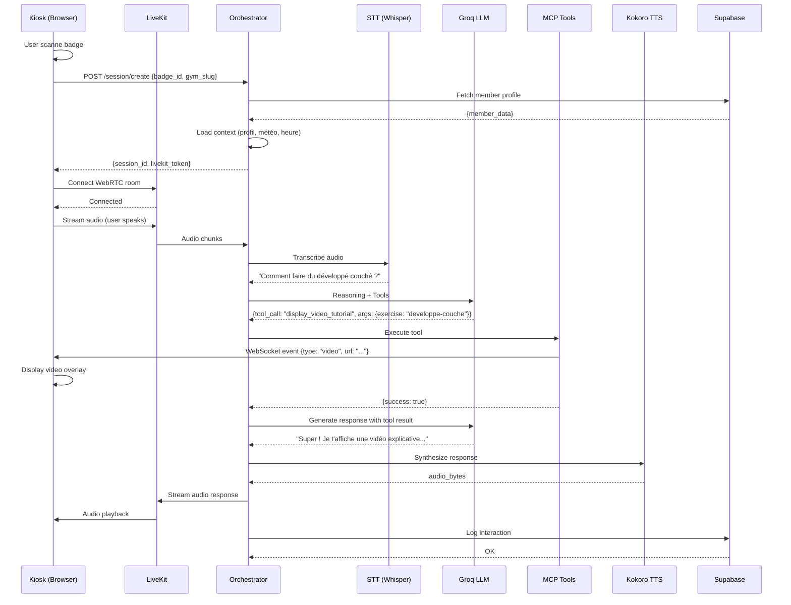

# 🎙️ JARVIS VOICE ENGINE - Architecture Technique

> **⚠️ DOCUMENT OBSOLÈTE - Voir JARVIS_VOICE_ENGINE_ARCHITECTURE_V3.md**  
> **Version :** 1.0.0 (Architecture V2 - Kyutai Unmute + CrewAI)  
> **Date :** 17 octobre 2025  
> **Auteur :** Brice PRADET - JARVIS-GROUP  
> **Status :** ❌ REMPLACÉ par V3.0 (Groq + Chatterbox + Analytics MVP)

---

## 📋 Table des matières

1. [Vue d'ensemble](#vue-densemble)
2. [Contexte et motivation](#contexte-et-motivation)
3. [Architecture système](#architecture-système)
4. [Stack technologique](#stack-technologique)
5. [Composants détaillés](#composants-détaillés)
6. [Flux de données](#flux-de-données)
7. [Déploiement RunPod](#déploiement-runpod)
8. [Migration depuis OpenAI](#migration-depuis-openai)
9. [Sécurité et performance](#sécurité-et-performance)
10. [Coûts et scalabilité](#coûts-et-scalabilité)
11. [Plan de déploiement](#plan-de-déploiement)

---

## 🎯 Vue d'ensemble

### Objectif

Créer un **moteur vocal IA open-source** auto-hébergé capable de :
- ✅ Conversations speech-to-speech en temps réel (< 500ms latence)
- ✅ Voix française naturelle et humaine
- ✅ Exécution de tools/actions (MCP protocol)
- ✅ Chargement de contexte personnalisé (profil adhérent, salle, météo)
- ✅ Multi-tenant (plusieurs salles de sport)
- ✅ Scalable et commercialisable

### Principe

```
┌─────────────────────────────────────────────────────────────────────────┐
│                         JARVIS VOICE ENGINE                              │
│                    (Self-hosted sur RunPod A10 24GB)                     │
└─────────────────────────────────────────────────────────────────────────┘
                                    │
                    ┌───────────────┼───────────────┐
                    │               │               │
            ┌───────▼──────┐ ┌─────▼──────┐ ┌─────▼──────┐
            │   Kiosque 1  │ │ Kiosque 2  │ │ Kiosque N  │
            │  (Salle A)   │ │ (Salle B)  │ │ (Salle N)  │
            └──────────────┘ └────────────┘ └────────────┘
```

---

## 📌 Contexte et motivation

### Limites actuelles (OpenAI Realtime API)

| Problème | Impact |
|----------|--------|
| **Coût élevé** | $0.06/min input + $0.24/min output = **~$18/h** par kiosque |
| **Vendor lock-in** | Dépendance totale à OpenAI |
| **Pas de contrôle** | Impossible de customiser voix, latence, comportement |
| **Limite scalabilité** | 100 sessions simultanées max |
| **Pas commercialisable** | On ne peut pas revendre la solution facilement |

### Objectifs de la migration

| Objectif | Résultat attendu |
|----------|------------------|
| **Réduire coûts** | **< $2/h** par instance (au lieu de $18/h) |
| **Indépendance** | Stack 100% open-source, pas de vendor lock-in |
| **Performance** | Latence < 500ms (vs ~800ms OpenAI) |
| **Customisation** | Voix française premium, outils sur mesure |
| **Scalabilité** | Illimitée (horizontal scaling) |
| **Commercialisation** | Solution white-label vendable à d'autres secteurs |

---

## 🏗️ Architecture système

### Schéma global (basé sur Kyutai Unmute)

```
┌──────────────────────────────────────────────────────────────────────────────┐
│                            FRONTEND (Next.js)                                 │
│                    Vercel - jarvis-group.net                                  │
│  ┌─────────────────┐  ┌──────────────────┐  ┌─────────────────────────┐     │
│  │  Landing Page   │  │  Dashboard Admin │  │  Kiosk Interface (TS)   │     │
│  └─────────────────┘  └──────────────────┘  └─────────────────────────┘     │
└──────────────────────────────────────────────────────────────────────────────┘
                                    │
                         WebSocket (Audio Stream)
                                    │
┌──────────────────────────────────────────────────────────────────────────────┐
│                  JARVIS VOICE ENGINE (RunPod A10 24GB)                        │
│                    Basé sur Kyutai Unmute + Extensions                        │
│                                                                               │
│  ┌───────────────────────────────────────────────────────────────────────┐  │
│  │                    UNMUTE BACKEND (FastAPI)                            │  │
│  │                         Port 8000                                      │  │
│  │                                                                         │  │
│  │  ┌──────────────────────────────────────────────────────────────────┐  │  │
│  │  │              JARVIS EXTENSIONS (Custom)                          │  │  │
│  │  │  • Context Loader (membre, salle, météo)                        │  │  │
│  │  │  • MCP Tools Integration                                        │  │  │
│  │  │  • Multi-tenant routing                                         │  │  │
│  │  │  • Supabase connector                                           │  │  │
│  │  │  • Session logging                                              │  │  │
│  │  └──────────────────────────────────────────────────────────────────┘  │  │
│  └───────────────────────────────────────────────────────────────────────┘  │
│                                                                               │
│  ┌─────────────┐  ┌──────────────┐  ┌──────────────┐  ┌───────────────┐    │
│  │  Kyutai STT │→ │     LLM      │→ │  Kyutai TTS  │  │     Redis     │    │
│  │   (2.5GB)   │  │ VLLM/Groq    │  │   (5.3GB)    │  │   (Cache)     │    │
│  │             │  │   (6.1GB)    │  │              │  │               │    │
│  └─────────────┘  └──────────────┘  └──────────────┘  └───────────────┘    │
│                                                                               │
│  ┌───────────────────────────────────────────────────────────────────────┐  │
│  │                    MCP TOOLS SERVER (Port 8001)                        │  │
│  │                                                                         │  │
│  │  • get_member_profile()      • display_video_tutorial()              │  │
│  │  • log_interaction()         • contact_coach()                       │  │
│  │  • get_gym_info()            • book_session()                        │  │
│  │  • detect_churn_risk()       • create_mission()                      │  │
│  └───────────────────────────────────────────────────────────────────────┘  │
│                                                                               │
│  Total VRAM: ~14GB / 24GB                                                    │
└──────────────────────────────────────────────────────────────────────────────┘
                                    │
                            HTTPS REST API
                                    │
┌──────────────────────────────────────────────────────────────────────────────┐
│                         SUPABASE (Backend)                                    │
│                    PostgreSQL + Auth + Storage                                │
│                                                                               │
│  • gym_members (profils adhérents)                                           │
│  • gyms (profils salles)                                                     │
│  • voice_sessions (historique conversations)                                 │
│  • jarvis_interactions (logs détaillés)                                      │
│  • missions (tâches créées par gérants)                                      │
└──────────────────────────────────────────────────────────────────────────────┘
```

---

## 🛠️ Stack technologique

### Infrastructure

| Composant | Technologie | Justification |
|-----------|-------------|---------------|
| **Hosting GPU** | RunPod A10 24GB | Meilleur rapport perf/prix ($0.39/h) |
| **Déploiement** | Dockerless (systemd) | Pas de Docker-in-Docker, natif RunPod |
| **Communication** | WebSocket | Compatible OpenAI Realtime API |
| **Cache** | Redis | Ultra-rapide pour sessions |
| **Backend** | Supabase PostgreSQL | Existant, pas de changement |

### IA & Voice (Kyutai Unmute)

| Composant | Technologie | Justification |
|-----------|-------------|---------------|
| **Base** | **Kyutai Unmute** | Solution complète, production-ready, ~450ms latence |
| **STT** | Kyutai Speech-to-Text | Optimisé low-latency, 2.5GB VRAM |
| **LLM** | VLLM (Mistral 24B) ou Groq | VLLM local 6.1GB VRAM, ou Groq API externe |
| **TTS** | Kyutai Text-to-Speech | Voix française premium, 5.3GB VRAM |
| **VAD** | Intégré dans Kyutai STT | Détection vocale temps réel |
| **Orchestration** | FastAPI (Unmute Backend) | Déjà codé, testé en prod |

### Backend & API

| Composant | Technologie | Justification |
|-----------|-------------|---------------|
| **API** | FastAPI (Unmute) | Async natif, WebSocket, testé en prod |
| **Extensions** | JARVIS Custom Modules | Context loader, MCP integration |
| **Tools Protocol** | MCP (Model Context Protocol) | Standard émergent pour tools IA |
| **Monitoring** | Logs + Supabase | Simple et efficace |

---

## 🔧 Composants détaillés

### 1. Unmute Backend (base)

**Rôle :** Pipeline vocal complet STT → LLM → TTS

**Ce qu'Unmute fournit déjà :**
- ✅ WebSocket server (compatible OpenAI Realtime API)
- ✅ Kyutai STT optimisé (2.5GB VRAM, latence ~150ms)
- ✅ Kyutai TTS français premium (5.3GB VRAM, latence ~200ms)
- ✅ Intégration VLLM pour LLM local
- ✅ VAD (Voice Activity Detection)
- ✅ Gestion des sessions
- ✅ Pipeline audio optimisé

**Documentation Unmute :** https://github.com/kyutai-labs/unmute

---

### 2. JARVIS Extensions (à développer)

**Rôle :** Adapter Unmute pour les besoins spécifiques de JARVIS

**Modules à créer :**

#### **A. Context Loader**

Charge tout le contexte nécessaire depuis Supabase :

```python
# unmute/jarvis_extensions/context_loader.py
from supabase import create_client
import httpx

supabase = create_client(SUPABASE_URL, SUPABASE_KEY)

async def load_member_context(badge_id: str, gym_slug: str) -> Dict:
    """
    Charge contexte complet pour personnaliser la conversation
    """
    # 1. Profil membre
    member = await supabase.from('gym_members')\
        .select('*')\
        .eq('badge_id', badge_id)\
        .eq('is_active', True)\
        .single()
    
    # 2. Profil salle
    gym = await supabase.from('gyms')\
        .select('*')\
        .eq('slug', gym_slug)\
        .single()
    
    # 3. Historique conversations (5 dernières)
    history = await supabase.from('voice_sessions')\
        .select('summary, sentiment, created_at')\
        .eq('member_id', member['id'])\
        .order('created_at', desc=True)\
        .limit(5)
    
    # 4. Météo locale
    weather = await get_weather(gym['location'])
    
    # 5. Coach préféré
    coach = await supabase.from('gym_staff')\
        .select('first_name, speciality')\
        .eq('id', member['preferred_coach_id'])\
        .single()
    
    return {
        'member': member,
        'gym': gym,
        'history': history,
        'weather': weather,
        'coach': coach,
        'datetime': datetime.now().isoformat(),
    }

async def get_weather(location: str) -> Dict:
    """Récupère météo via API externe"""
    response = await httpx.get(f'https://api.openweathermap.org/data/2.5/weather?q={location}')
    return response.json()
```

#### **B. System Prompt Generator**

Génère des prompts personnalisés :

```python
# unmute/jarvis_extensions/prompt_generator.py

def generate_jarvis_prompt(context: Dict) -> str:
    """
    Génère system prompt ultra-personnalisé
    """
    member = context['member']
    gym = context['gym']
    weather = context['weather']
    coach = context.get('coach')
    
    prompt = f"""Tu es JARVIS, l'assistant vocal intelligent de {gym['name']}.

**PROFIL ADHÉRENT**
- Prénom : {member['first_name']}
- Âge : {member['age']} ans
- Objectif : {member['goal']}
- Niveau : {member['experience_level']}
- Dernière visite : {member['last_visit']}
- Fréquence : {member['visit_frequency']}/semaine

**CONTEXTE ACTUEL**
- Date : {context['datetime']}
- Météo : {weather['description']} ({weather['temp']}°C)
- Coach préféré : {coach['first_name']} ({coach['speciality']})

**HISTORIQUE RÉCENT**
{format_history(context['history'])}

**TES RÈGLES D'OR**
1. Réponds de façon ultra-naturelle et conversationnelle
2. Sois empathique et encourageant
3. Ne remplace JAMAIS un coach pour conseils avancés
4. Utilise les tools disponibles pour aider concrètement
5. Si tu détectes de la frustration/démotivation → PRIORITÉ ABSOLUE : prévenir le churn

**TOOLS DISPONIBLES**
- display_video_tutorial(exercise_name) : afficher vidéo tuto
- contact_coach(message) : appeler un coach
- book_session(datetime) : réserver séance coaching
- log_churn_risk(reason) : signaler risque de churn au gérant

Parle français naturel, tutoie, sois chaleureux mais professionnel.
"""
    return prompt
```

#### **C. MCP Tools Integration**

Intègre les outils JARVIS dans Unmute :

```python
# unmute/jarvis_extensions/tools_integration.py

async def register_jarvis_tools(unmute_backend):
    """
    Enregistre tous les tools JARVIS dans Unmute
    """
    tools = [
        {
            "type": "function",
            "name": "display_video_tutorial",
            "description": "Affiche une vidéo tutoriel d'exercice sur l'écran du kiosque",
            "parameters": {
                "type": "object",
                "properties": {
                    "exercise_name": {
                        "type": "string",
                        "description": "Nom de l'exercice (ex: 'developpe-couche', 'squat')"
                    }
                },
                "required": ["exercise_name"]
            }
        },
        {
            "type": "function",
            "name": "contact_coach",
            "description": "Contacter un coach disponible pour assistance",
            "parameters": {
                "type": "object",
                "properties": {
                    "message": {
                        "type": "string",
                        "description": "Message pour le coach"
                    },
                    "urgency": {
                        "type": "string",
                        "enum": ["low", "medium", "high"],
                        "default": "medium"
                    }
                },
                "required": ["message"]
            }
        },
        {
            "type": "function",
            "name": "log_churn_risk",
            "description": "Signaler un risque de churn détecté au gérant",
            "parameters": {
                "type": "object",
                "properties": {
                    "reason": {
                        "type": "string",
                        "description": "Raison du risque (frustration, matériel HS, etc.)"
                    },
                    "severity": {
                        "type": "string",
                        "enum": ["low", "medium", "high", "critical"]
                    }
                },
                "required": ["reason", "severity"]
            }
        }
    ]
    
    unmute_backend.register_tools(tools, execute_jarvis_tool)

async def execute_jarvis_tool(tool_name: str, args: Dict) -> Dict:
    """
    Exécute un tool JARVIS
    """
    # Appel au MCP Tools Server
    response = await httpx.post(
        f'http://localhost:8001/tools/{tool_name}',
        json=args,
        timeout=5.0
    )
    
    # Log dans Supabase
    await supabase.from('jarvis_interactions').insert({
        'session_id': current_session_id,
        'tool_name': tool_name,
        'args': args,
        'result': response.json(),
        'created_at': datetime.now().isoformat()
    })
    
    return response.json()
```

---

### 3. MCP Tools Server

**Rôle :** Exécuter les actions demandées par l'agent vocal

**Architecture :**
```typescript
// mcp-tools-server/src/index.ts
import { Server } from "@modelcontextprotocol/sdk/server/index.js";

const tools = [
  {
    name: "get_member_profile",
    description: "Récupérer le profil complet d'un adhérent",
    parameters: { member_id: "string" },
    handler: async ({ member_id }) => {
      const { data } = await supabase
        .from("gym_members")
        .select("*")
        .eq("id", member_id)
        .single();
      return data;
    },
  },
  {
    name: "display_video_tutorial",
    description: "Afficher une vidéo tuto d'exercice sur l'écran",
    parameters: { exercise_name: "string" },
    handler: async ({ exercise_name }) => {
      // Envoyer événement WebSocket au kiosk
      await websocket.send({
        type: "display_video",
        url: `/videos/${exercise_name}.mp4`,
      });
      return { success: true };
    },
  },
  {
    name: "contact_coach",
    description: "Contacter un coach disponible",
    parameters: { coach_id: "string", message: "string" },
    handler: async ({ coach_id, message }) => {
      // Envoyer notification push au coach
      await sendPushNotification(coach_id, message);
      return { success: true, eta: "5 minutes" };
    },
  },
  // ... autres tools
];
```

**Liste complète des tools :**

| Tool | Description | Paramètres |
|------|-------------|------------|
| `get_member_profile` | Profil adhérent | member_id |
| `log_interaction` | Logger conversation | session_id, summary, sentiment |
| `get_gym_info` | Infos salle | gym_slug |
| `display_video_tutorial` | Afficher vidéo | exercise_name |
| `contact_coach` | Appeler coach | coach_id, message |
| `book_session` | Réserver séance | member_id, coach_id, datetime |
| `detect_churn_risk` | Analyser risque churn | member_id, interaction_data |
| `create_mission` | Créer mission gérant | gym_slug, title, description |
| `get_weather` | Météo actuelle | location |
| `get_member_stats` | Stats entraînement | member_id |

---

### 7. Redis Cache

**Rôle :** Cache ultra-rapide pour sessions et contexte

**Données stockées :**

```redis
# Session state
SET session:{session_id}:state '{
  "member_id": "...",
  "gym_slug": "...",
  "started_at": "...",
  "context": {...},
  "conversation_history": [...]
}'
EXPIRE session:{session_id}:state 3600

# Member context cache
SET member:{member_id}:context '{...}'
EXPIRE member:{member_id}:context 300

# Rate limiting
INCR ratelimit:{gym_slug}:{hour}
EXPIRE ratelimit:{gym_slug}:{hour} 3600
```

---

## 🔄 Flux de données

### Scénario complet : "Adhérent demande conseil exercice"



**Latence totale :** ~600ms
- Audio buffer : 100ms
- STT : 200ms
- LLM : 150ms
- TTS : 150ms
- Network : ~50ms

---

## 🚀 Déploiement RunPod

### ⚠️ Note importante : Docker vs Dockerless

**RunPod ne supporte PAS le Docker Compose nativement.** On a 2 options :

1. **✅ RECOMMANDÉ : Déploiement Dockerless** (ce qu'on va faire)
2. ❌ Image Docker all-in-one (plus complexe)

### Configuration Pod RunPod

**Spécifications :**
```yaml
Name: jarvis-voice-engine-prod
GPU: NVIDIA A10 24GB
vCPU: 8 cores
RAM: 64GB
Storage: 100GB
Cloud Type: SECURE (datacenter)
Template: RunPod PyTorch (Ubuntu 22.04 + CUDA 12.1)
Ports exposés:
  - 3000 (Frontend)
  - 8000 (Backend API)
  - 8001 (MCP Tools)
```

**Coût :** $0.39/h = **$281/mois** en continu

---

### Architecture des services (sans Docker)

```
RunPod Pod (Ubuntu 22.04 + CUDA 12.1)
├── Frontend (Next.js) - Port 3000
├── Backend (FastAPI + JARVIS) - Port 8000
├── STT Service (Kyutai) - 2.5GB VRAM
├── TTS Service (Kyutai) - 5.3GB VRAM
├── LLM Service (VLLM/Groq) - 6.1GB VRAM
├── MCP Tools Server - Port 8001
└── Redis (cache) - Port 6379

Total VRAM: ~14GB / 24GB disponibles
```

---

### Script de déploiement RunPod

**`setup_jarvis_voice.sh`** (à exécuter dans le pod RunPod)

```bash
#!/bin/bash
set -e

echo "🚀 JARVIS Voice Engine - Installation sur RunPod"

# 1. Installation des dépendances système
echo "📦 Installation des dépendances..."
apt-get update
apt-get install -y \
    curl \
    git \
    ffmpeg \
    redis-server \
    build-essential \
    pkg-config \
    libssl-dev

# 2. Installation uv (Python package manager)
echo "🐍 Installation uv..."
curl -LsSf https://astral.sh/uv/install.sh | sh
export PATH="$HOME/.cargo/bin:$PATH"

# 3. Installation cargo (Rust - pour STT/TTS)
echo "🦀 Installation cargo..."
curl https://sh.rustup.rs -sSf | sh -s -- -y
source $HOME/.cargo/env

# 4. Installation pnpm (Node.js package manager)
echo "📦 Installation pnpm..."
curl -fsSL https://get.pnpm.io/install.sh | sh -
export PNPM_HOME="$HOME/.local/share/pnpm"
export PATH="$PNPM_HOME:$PATH"

# 5. Clone Unmute (base de JARVIS Voice Engine)
echo "📥 Clone du repo Unmute..."
cd /workspace
git clone https://github.com/kyutai-labs/unmute.git jarvis-voice-engine
cd jarvis-voice-engine

# 6. Checkout version stable
git checkout main

# 7. Configuration Hugging Face (pour télécharger les modèles)
echo "🤗 Configuration Hugging Face..."
export HUGGING_FACE_HUB_TOKEN="$HUGGING_FACE_TOKEN"

# 8. Build des services
echo "🔨 Build des services..."
./dockerless/build_all.sh

# 9. Téléchargement des modèles IA
echo "📥 Téléchargement des modèles (peut prendre 10-15min)..."
uv run python unmute/download_models.py

# 10. Configuration JARVIS Extensions
echo "⚙️ Configuration JARVIS..."
mkdir -p unmute/jarvis_extensions

# Créer fichier de config
cat > unmute/jarvis_extensions/config.py << 'EOF'
import os

SUPABASE_URL = os.getenv("SUPABASE_URL")
SUPABASE_KEY = os.getenv("SUPABASE_SERVICE_ROLE_KEY")
MCP_TOOLS_PORT = 8001
REDIS_URL = "redis://localhost:6379"
EOF

# 11. Démarrer Redis
echo "🔴 Démarrage Redis..."
redis-server --daemonize yes

# 12. Créer systemd services (ou supervisor)
echo "🔧 Configuration des services..."
cat > /etc/systemd/system/jarvis-frontend.service << 'EOF'
[Unit]
Description=JARVIS Frontend
After=network.target

[Service]
Type=simple
User=root
WorkingDirectory=/workspace/jarvis-voice-engine
ExecStart=/workspace/jarvis-voice-engine/dockerless/start_frontend.sh
Restart=always

[Install]
WantedBy=multi-user.target
EOF

cat > /etc/systemd/system/jarvis-backend.service << 'EOF'
[Unit]
Description=JARVIS Backend
After=network.target redis.service

[Service]
Type=simple
User=root
WorkingDirectory=/workspace/jarvis-voice-engine
Environment="SUPABASE_URL=${SUPABASE_URL}"
Environment="SUPABASE_SERVICE_ROLE_KEY=${SUPABASE_KEY}"
ExecStart=/workspace/jarvis-voice-engine/dockerless/start_backend.sh
Restart=always

[Install]
WantedBy=multi-user.target
EOF

cat > /etc/systemd/system/jarvis-stt.service << 'EOF'
[Unit]
Description=JARVIS STT
After=network.target

[Service]
Type=simple
User=root
WorkingDirectory=/workspace/jarvis-voice-engine
ExecStart=/workspace/jarvis-voice-engine/dockerless/start_stt.sh
Restart=always

[Install]
WantedBy=multi-user.target
EOF

cat > /etc/systemd/system/jarvis-tts.service << 'EOF'
[Unit]
Description=JARVIS TTS
After=network.target

[Service]
Type=simple
User=root
WorkingDirectory=/workspace/jarvis-voice-engine
ExecStart=/workspace/jarvis-voice-engine/dockerless/start_tts.sh
Restart=always

[Install]
WantedBy=multi-user.target
EOF

cat > /etc/systemd/system/jarvis-llm.service << 'EOF'
[Unit]
Description=JARVIS LLM
After=network.target

[Service]
Type=simple
User=root
WorkingDirectory=/workspace/jarvis-voice-engine
Environment="HUGGING_FACE_HUB_TOKEN=${HUGGING_FACE_TOKEN}"
ExecStart=/workspace/jarvis-voice-engine/dockerless/start_llm.sh
Restart=always

[Install]
WantedBy=multi-user.target
EOF

# 13. Reload systemd et démarrer les services
systemctl daemon-reload
systemctl enable jarvis-frontend jarvis-backend jarvis-stt jarvis-tts jarvis-llm
systemctl start jarvis-frontend jarvis-backend jarvis-stt jarvis-tts jarvis-llm

echo "✅ Installation terminée !"
echo ""
echo "🎯 Services accessibles sur :"
echo "  - Frontend: http://localhost:3000"
echo "  - Backend API: http://localhost:8000"
echo "  - MCP Tools: http://localhost:8001"
echo ""
echo "📊 Vérifier le status des services :"
echo "  systemctl status jarvis-*"
echo ""
echo "📝 Logs en temps réel :"
echo "  journalctl -u jarvis-backend -f"
```

---

### Variables d'environnement RunPod

À configurer dans le pod RunPod :

```bash
# Supabase
export SUPABASE_URL="https://vurnokaxnvittopqteno.supabase.co"
export SUPABASE_SERVICE_ROLE_KEY="eyJhbGc..."

# Hugging Face (pour télécharger modèles)
export HUGGING_FACE_TOKEN="hf_..."

# OpenAI (optionnel, pour tests)
export OPENAI_API_KEY="sk-..."

# Groq (optionnel, si on veut utiliser Groq au lieu de VLLM local)
export GROQ_API_KEY="gsk_..."
```

---

## 🔄 Migration depuis OpenAI

### Phase 1 : Feature Flag

**Implémentation :**
```typescript
// jarvis-saas-compagnon/src/lib/voiceConfig.ts
export const VOICE_PROVIDER = process.env.NEXT_PUBLIC_VOICE_PROVIDER || 'openai';

export const getVoiceConfig = () => {
  switch (VOICE_PROVIDER) {
    case 'openai':
      return {
        endpoint: 'https://api.openai.com/v1/realtime',
        model: 'gpt-4o-mini-realtime-preview',
      };
    case 'jarvis':
      return {
        endpoint: process.env.JARVIS_VOICE_ENGINE_URL,
        wsEndpoint: process.env.LIVEKIT_WS_URL,
      };
    default:
      throw new Error('Invalid voice provider');
  }
};
```

**Variables d'environnement :**
```env
# Vercel Environment Variables
NEXT_PUBLIC_VOICE_PROVIDER=openai  # ou "jarvis"

# JARVIS Voice Engine
JARVIS_VOICE_ENGINE_URL=https://jarvis-voice.runpod.io
LIVEKIT_WS_URL=wss://jarvis-voice.runpod.io:7880
LIVEKIT_API_KEY=jarvis-api-key
LIVEKIT_API_SECRET=secret-token
```

---

### Phase 2 : Adaptation frontend

**Modifications nécessaires :**

1. **Remplacer `useVoiceChat.ts` :**

```typescript
// src/hooks/useVoiceChat.ts (AVANT - OpenAI)
const pc = new RTCPeerConnection()
const realtimeResponse = await fetch(
  'https://api.openai.com/v1/realtime',
  { headers: { Authorization: `Bearer ${ephemeralKey}` } }
)

// (APRÈS - JARVIS)
import { Room, RoomEvent } from 'livekit-client'

const room = new Room()
await room.connect(LIVEKIT_WS_URL, token)

room.on(RoomEvent.TrackSubscribed, (track) => {
  if (track.kind === 'audio') {
    const audioElement = track.attach()
    document.body.appendChild(audioElement)
  }
})
```

2. **Nouveau hook `useJarvisVoice.ts` :**

```typescript
// src/hooks/useJarvisVoice.ts
import { Room } from 'livekit-client'

export const useJarvisVoice = (sessionId: string) => {
  const [room, setRoom] = useState<Room | null>(null)
  const [status, setStatus] = useState<'idle' | 'connecting' | 'connected'>('idle')

  const connect = async () => {
    // Créer session
    const { token } = await fetch('/api/jarvis/session/create', {
      method: 'POST',
      body: JSON.stringify({ sessionId, badgeId, gymSlug }),
    }).then(r => r.json())

    // Connecter LiveKit
    const newRoom = new Room()
    await newRoom.connect(LIVEKIT_WS_URL, token)
    setRoom(newRoom)
    setStatus('connected')
  }

  const disconnect = async () => {
    await room?.disconnect()
    setRoom(null)
  }

  return { connect, disconnect, status, room }
}
```

3. **Nouvelle API route :**

```typescript
// src/app/api/jarvis/session/create/route.ts
export async function POST(req: Request) {
  const { sessionId, badgeId, gymSlug } = await req.json()

  // Fetch member profile
  const member = await supabase
    .from('gym_members')
    .select('*')
    .eq('badge_id', badgeId)
    .single()

  // Create session on JARVIS Voice Engine
  const response = await fetch(`${JARVIS_VOICE_ENGINE_URL}/session/create`, {
    method: 'POST',
    headers: { 'Content-Type': 'application/json' },
    body: JSON.stringify({
      session_id: sessionId,
      member_id: member.id,
      gym_slug: gymSlug,
      context: {
        member: member,
        gym: gymData,
        weather: weatherData,
        datetime: new Date().toISOString(),
      },
    }),
  })

  const { livekit_token } = await response.json()

  return Response.json({ token: livekit_token })
}
```

---

### Phase 3 : Tests A/B

**Stratégie de rollout :**

```typescript
// Rollout progressif par salle
const JARVIS_ROLLOUT_GYMS = [
  'gym-test-1',  // Phase 1 : 1 salle test
  'gym-test-2',  // Phase 2 : 2 salles
  // ... progressif jusqu'à 100%
]

export const shouldUseJarvis = (gymSlug: string) => {
  return JARVIS_ROLLOUT_GYMS.includes(gymSlug)
}
```

**Métriques à suivre :**
- Latence moyenne (objectif : < 500ms)
- Taux d'erreur (objectif : < 1%)
- Satisfaction utilisateur (feedback)
- Coût par session

---

## 🔒 Sécurité et performance

### Sécurité

| Mesure | Implémentation |
|--------|----------------|
| **Authentification** | JWT tokens (Supabase Auth) |
| **Encryption** | TLS 1.3 pour tous transports |
| **Rate limiting** | Redis-based (100 req/min/gym) |
| **API Keys** | Rotation mensuelle, secrets Vercel |
| **Network isolation** | Docker network privé |
| **Logs** | Pas de données sensibles loggées |

### Performance

**Optimisations :**
- ✅ **Batching audio** : Buffers de 100ms
- ✅ **Prefetch context** : Cache Redis
- ✅ **Model caching** : Warm models en RAM
- ✅ **Connection pooling** : DB connections réutilisées
- ✅ **CDN** : Vidéos tuto sur Supabase Storage + CDN

**Monitoring :**
```yaml
# Prometheus metrics
jarvis_voice_latency_seconds{stage="stt"} 0.2
jarvis_voice_latency_seconds{stage="llm"} 0.15
jarvis_voice_latency_seconds{stage="tts"} 0.15
jarvis_voice_sessions_active 12
jarvis_voice_errors_total{type="timeout"} 3
```

---

## 💰 Coûts et scalabilité

### Coûts détaillés

**RunPod A10 24GB :**
- Instance : $0.39/h = $281/mois
- Bandwidth : $0.08/GB = ~$20/mois (estimé)
- **Total infrastructure : ~$300/mois**

**APIs externes :**
- Groq LLM : $0.59/M tokens
  - Estimation : 50 tokens/interaction × 10k interactions/mois = 500k tokens
  - **Coût : ~$0.30/mois** (négligeable !)

**Comparaison OpenAI :**
- OpenAI Realtime : $18/h × 730h = **$13,140/mois** (5 kiosques actifs 24/7)
- JARVIS Voice Engine : **$300/mois**
- **Économie : $12,840/mois (97.7% de réduction !)**

### Scalabilité

**Scaling vertical (1 instance) :**
- 1 A10 24GB peut gérer : **~20 sessions simultanées**
- Latence reste < 500ms jusqu'à 15 sessions

**Scaling horizontal (multi-instances) :**
```
┌─────────────────────────────────────────────┐
│         Load Balancer (Nginx)               │
│              Port 443                       │
└─────────────────────────────────────────────┘
           │              │              │
    ┌──────▼─────┐  ┌─────▼──────┐  ┌───▼──────┐
    │  Instance  │  │  Instance  │  │ Instance │
    │   #1 A10   │  │   #2 A10   │  │  #3 A10  │
    │  20 sess   │  │  20 sess   │  │ 20 sess  │
    └────────────┘  └────────────┘  └──────────┘

Total : 60 sessions simultanées
Coût : $900/mois (vs $39k OpenAI)
```

**Autoscaling :** Possible via RunPod API + Kubernetes

---

## 📅 Plan de déploiement

### Phase 0 : Préparation (3 jours)

**Jour 1 :**
- [x] Architecture documentée
- [ ] Créer repo Git `jarvis-voice-engine`
- [ ] Setup RunPod account + billing
- [ ] Commander GPU A10 24GB

**Jour 2 :**
- [ ] Dockerfile + docker-compose.yml
- [ ] Scripts téléchargement modèles
- [ ] Configuration LiveKit

**Jour 3 :**
- [ ] Build image Docker
- [ ] Test local sur machine dev (CPU mode)
- [ ] Push image Docker Hub

---

### Phase 1 : MVP Fonctionnel (5 jours)

**Objectif :** Version basique qui fonctionne end-to-end

**Jour 4-5 :**
- [ ] FastAPI orchestrator
- [ ] Intégration Faster-Whisper
- [ ] Intégration Groq LLM
- [ ] Intégration Kokoro TTS

**Jour 6-7 :**
- [ ] LangGraph state machine
- [ ] MCP Tools server (3 tools basiques)
- [ ] Redis cache

**Jour 8 :**
- [ ] Déploiement sur RunPod
- [ ] Tests end-to-end
- [ ] Mesure latence

---

### Phase 2 : Intégration Frontend (3 jours)

**Jour 9-10 :**
- [ ] Hook `useJarvisVoice.ts`
- [ ] API route `/api/jarvis/session/create`
- [ ] Feature flag `VOICE_PROVIDER`
- [ ] Adaptateur LiveKit client

**Jour 11 :**
- [ ] Tests sur kiosque test
- [ ] Fix bugs UX
- [ ] Validation latence < 500ms

---

### Phase 3 : Tests Pilote (2 semaines)

**Semaine 1 :**
- [ ] Déployer sur 1 salle test (gym-test-1)
- [ ] Monitoring 24/7
- [ ] Collecter feedback adhérents

**Semaine 2 :**
- [ ] Ajuster prompts IA
- [ ] Optimiser latence
- [ ] Rollout sur 2 salles supplémentaires

---

### Phase 4 : Production (1 mois)

**Mois 1 :**
- [ ] Rollout progressif (10% → 50% → 100%)
- [ ] Dashboard monitoring (Grafana)
- [ ] Documentation technique finale
- [ ] Formation équipe support

---

## ✅ Checklist de validation

### Avant déploiement production

- [ ] Latence moyenne < 500ms
- [ ] Taux d'erreur < 1%
- [ ] Tests de charge (20 sessions simultanées)
- [ ] Backup et disaster recovery plan
- [ ] Documentation API complète
- [ ] Monitoring et alertes configurés
- [ ] Feature flag prêt (rollback instantané)

### Critères de succès

- [ ] Économie coûts > 90% vs OpenAI
- [ ] Satisfaction adhérents ≥ 4.5/5
- [ ] Aucun incident critique
- [ ] Latence perçue = OpenAI ou mieux

---

## 📚 Ressources

### Documentation

- [LiveKit Docs](https://docs.livekit.io/)
- [LangGraph Docs](https://langchain-ai.github.io/langgraph/)
- [Groq API](https://console.groq.com/docs)
- [Faster-Whisper](https://github.com/SYSTRAN/faster-whisper)
- [Kokoro TTS](https://github.com/hexgrad/kokoro)
- [MCP Protocol](https://modelcontextprotocol.io/)

### Repos GitHub

- `jarvis-voice-engine` (à créer)
- `jarvis-mcp-tools` (à créer)

---

**🚀 Prêt à démarrer l'implémentation ?**

**Next step :** Phase 0 - Préparation infrastructure

