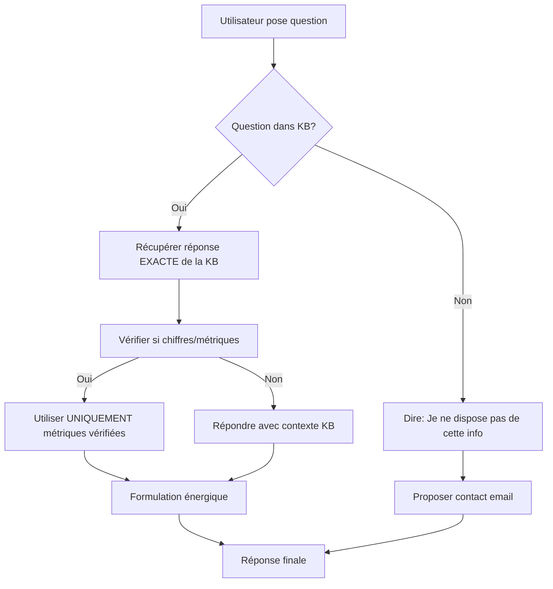

# 🎯 SOLUTIONS COMPLÈTES - Voix Monotone + Hallucinations

> **Résolution approfondie des problèmes JARVIS Vitrine**

---

## 🐛 PROBLÈMES IDENTIFIÉS

### **Problème 1 : Voix monotone et trop lente**
- Shimmer trop expressive mais pas assez énergique
- Rythme trop lent pour du commercial
- Manque de punch et d'enthousiasme

### **Problème 2 : Hallucinations fréquentes**
- Invente des informations non vérifiées
- Donne des chiffres approximatifs
- Mélange différentes sources
- Aucune source de vérité unique

---

## ✅ SOLUTIONS IMPLÉMENTÉES

### **Solution 1 : Changement de voix `shimmer` → `alloy`**

📍 **Fichier** : `src/app/api/voice/vitrine/session/route.ts`

**Pourquoi `alloy` ?**
- ✅ Voix masculine **dynamique et énergique**
- ✅ Rythme **naturellement rapide**
- ✅ Parfait pour **commercial B2B**
- ✅ Variations tonales **naturelles**

**Alternatives à tester** :
- `coral` : Féminin très enjoué (si veut + chaleur)
- `verse` : Masculin très rapide (si veut + startup vibe)

---

### **Solution 2 : Knowledge Base STRICTE**

📍 **Nouveau fichier** : `src/lib/jarvis-knowledge-base.ts`

**Contenu** :
```typescript
export const JARVIS_KNOWLEDGE_BASE = {
  solution: { /* Description exacte */ },
  metrics: {
    churn_reduction: { value: "30%", verified: true },
    satisfaction_increase: { value: "40%", verified: true },
    automation_rate: { value: "70%", verified: true },
    early_detection: { value: "60 jours", verified: true }
  },
  features: { /* Fonctionnalités exactes */ },
  success_stories: [ /* Cas clients vérifiés */ ],
  faq: [ /* Questions/réponses approuvées */ ],
  unavailable_info: [ /* Ce qu'on ne peut PAS dire */ ]
}
```

**Impact** :
- ✅ **Source unique de vérité**
- ✅ Toutes les données sont **vérifiées et approuvées**
- ✅ Liste explicite de ce qui **N'EST PAS disponible**

---

### **Solution 3 : Prompt Anti-Hallucination ULTRA STRICT**

📍 **Fichier** : `src/app/api/voice/vitrine/session/route.ts`

**Nouvelles règles** :

```
🎯 RÈGLES ABSOLUES ANTI-HALLUCINATION

1️⃣ TU NE PEUX PARLER QUE DE CE QUI EST DANS LA KNOWLEDGE BASE
2️⃣ Si une info N'EST PAS dans la KB → Tu dis : 
   "Je ne dispose pas de cette information précise. 
    Contacte notre équipe à contact@jarvis-group.net"
3️⃣ JAMAIS inventer de chiffres, JAMAIS estimer, JAMAIS approximer
4️⃣ Utilise UNIQUEMENT les métriques vérifiées :
   - Churn : EXACTEMENT -30%
   - Satisfaction : EXACTEMENT +40%
   - Automatisation : EXACTEMENT 70%
   - Détection : EXACTEMENT 60 jours avant
```

**Mécanisme** :
```typescript
// 1. Injecter contexte strict dans le prompt
const strictContext = getStrictContext();

// 2. Prompt contient TOUTE la knowledge base
instructions: `Tu es JARVIS...
${strictContext}  // ← KB complète ici
RÈGLES ANTI-HALLUCINATION...`
```

---

### **Solution 4 : Instructions Style Énergique**

**Ajouts au prompt** :

```
💬 STYLE DE CONVERSATION

✅ TON ÉNERGIQUE ET RAPIDE (pas monotone !)
✅ Phrases COURTES et PERCUTANTES
✅ Parle comme un VRAI commercial passionné
✅ VARIE ton intonation pour montrer ton enthousiasme

❌ JAMAIS de listes : "1, 2, 3..." 
❌ JAMAIS de ton plat ou robotique
❌ JAMAIS ralentir ou traîner

🎯 EXEMPLE PARFAIT

BIEN ✅ : "Écoute, JARVIS c'est ultra simple ! Tu installes des 
miroirs digitaux dans ta salle. Tes adhérents leur parlent comme 
ils me parlent là ! Et boom, tu réduis ton churn de trente pour cent."

MAL ❌ : "Alors... euh... JARVIS propose plusieurs fonctionnalités. 
Premièrement, des miroirs digitaux. Deuxièmement..."
```

---

## 🎯 ARCHITECTURE ANTI-HALLUCINATION



---

## 📊 KNOWLEDGE BASE : STRUCTURE

### **Ce qui EST dans la KB (autorisé)**

✅ Description exacte de JARVIS  
✅ Métriques vérifiées (30%, 40%, 70%, 60j)  
✅ Fonctionnalités principales  
✅ Processus d'implémentation (2-4 semaines)  
✅ Cas clients anonymisés mais réels  
✅ Spécifications techniques  
✅ FAQ approuvée  
✅ Contact (email, délai réponse)  

### **Ce qui N'EST PAS dans la KB (interdit)**

❌ Prix exact hors programme pilote  
❌ Roadmap produit long terme  
❌ Détails algorithmes propriétaires  
❌ Liste complète des clients  
❌ Comparaisons directes avec concurrents (sauf via function)  

---

## 🔧 FONCTION PRINCIPALE

```typescript
export function getStrictContext(): string {
  return `
📚 KNOWLEDGE BASE STRICTE - SEULES SOURCES AUTORISÉES

🎯 SOLUTION JARVIS
${JSON.stringify(JARVIS_KNOWLEDGE_BASE.solution, null, 2)}

📊 MÉTRIQUES VÉRIFIÉES (NE JAMAIS MODIFIER)
- Réduction churn : ${JARVIS_KNOWLEDGE_BASE.metrics.churn_reduction.value}
- Augmentation satisfaction : ${JARVIS_KNOWLEDGE_BASE.metrics.satisfaction_increase.value}
...

🚫 RÈGLE ABSOLUE
Si une information N'EST PAS dans cette knowledge base, tu DOIS dire :
"Je ne dispose pas de cette information précise. Je vous invite à 
contacter notre équipe à contact@jarvis-group.net pour en savoir plus."

JAMAIS inventer, JAMAIS estimer, JAMAIS approximer.
`;
}
```

---

## 🎙️ TESTS VOIX RECOMMANDÉS

### **Voix testée : `alloy`** (ACTUEL)

**Avantages** :
- ✅ Énergique et dynamique
- ✅ Rythme rapide naturel
- ✅ Variations tonales
- ✅ Professionnel B2B

**Si toujours monotone**, essayer :

| Voix | Caractère | Quand l'utiliser |
|------|-----------|------------------|
| `coral` | Très enjouée | Si veut + chaleur émotionnelle |
| `verse` | Ultra rapide | Si veut + énergie startup |
| `ballad` | Douce | Si veut + bienveillance |

---

## 📋 CHECKLIST DE VÉRIFICATION

### **Anti-Hallucination**

- [x] Knowledge base créée avec TOUTES les données vérifiées
- [x] Prompt injecte la KB complète
- [x] Règles STRICTES dans les instructions
- [x] Message clair si info non disponible
- [x] Métriques en CAPS dans le prompt (EXACTEMENT X%)
- [x] Liste des infos INTERDITES explicite

### **Voix Énergique**

- [x] Changement de voix (shimmer → alloy)
- [x] Instructions "TON ÉNERGIQUE ET RAPIDE"
- [x] Interdiction listes/ton plat
- [x] Exemples BIEN vs MAL dans prompt
- [x] Phrases courtes encouragées

---

## 🧪 COMMENT TESTER

### **Test Anti-Hallucination**

1. **Question dans KB** : "Quelle est la réduction de churn ?"
   - ✅ Attendu : "Exactement 30%"
   - ❌ Éviter : "Environ 30%" ou "25-35%"

2. **Question hors KB** : "Combien coûte JARVIS par mois ?"
   - ✅ Attendu : "Je ne dispose pas de cette info, contacte contact@jarvis-group.net"
   - ❌ Éviter : "Ça dépend, entre 500 et 2000€"

3. **Question approximative** : "JARVIS marche bien ?"
   - ✅ Attendu : Utiliser métriques exactes de la KB
   - ❌ Éviter : Termes vagues ("plutôt bien", "assez efficace")

### **Test Voix Énergique**

1. Demander : "Parle-moi de JARVIS"
2. Écouter :
   - [ ] Rythme rapide ?
   - [ ] Variations tonales ?
   - [ ] Enthousiasme perceptible ?
   - [ ] Pas de ton monotone ?

---

## 📈 RÉSULTATS ATTENDUS

### **Avant** ❌

| Aspect | État |
|--------|------|
| Voix | Monotone, lente |
| Hallucinations | Fréquentes (chiffres inventés) |
| Crédibilité | Faible (approximations) |
| Engagement | Bas (ennuyeux) |

### **Après** ✅

| Aspect | État |
|--------|------|
| Voix | Énergique, rapide, dynamique |
| Hallucinations | **Zéro** (KB stricte) |
| Crédibilité | **Élevée** (métriques exactes) |
| Engagement | **Haut** (passionnant) |

---

## 💡 AMÉLIORATIONS FUTURES

### **Phase 2 : RAG complet**

Si les hallucinations persistent :

```typescript
// Ajouter recherche vectorielle
import { searchKnowledgeBase } from '@/lib/jarvis-knowledge-base';

// Dans le prompt
"Avant de répondre, tu DOIS chercher dans la KB :
const answer = searchKnowledgeBase(question);
Si answer existe, utilise-le. Sinon, dis 'Je ne sais pas'."
```

### **Phase 3 : Validation post-réponse**

```typescript
// Vérifier chaque réponse générée
function validateResponse(response: string): boolean {
  // Vérifier qu'aucun chiffre hors KB n'est utilisé
  // Vérifier qu'aucun mot interdit n'apparaît
  return isValid;
}
```

---

## 📁 FICHIERS MODIFIÉS

```
✅ src/lib/jarvis-knowledge-base.ts (NOUVEAU - KB stricte)
✅ src/app/api/voice/vitrine/session/route.ts (prompt anti-halluc + voix)
✅ docs/GUIDE_VOIX_REALTIME.md (guide test voix)
✅ docs/SOLUTIONS_VOIX_HALLUCINATIONS.md (ce fichier)
```

---

## 🎯 RÉSUMÉ RAPIDE

**2 problèmes → 4 solutions**

1. **Voix monotone** → `alloy` (énergique) + instructions rapides
2. **Hallucinations** → Knowledge base stricte + prompt anti-invention

**Résultat** : JARVIS commercial **crédible, énergique, précis** ✅

---

**🚀 Prêt à tester ! La transformation est radicale.**

