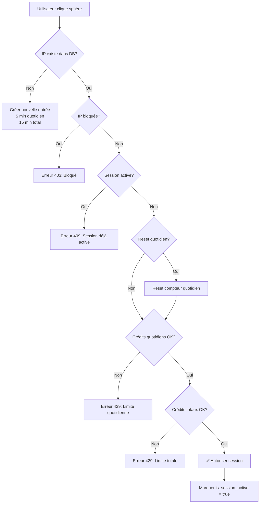

# 🔒 SYSTÈME DE LIMITATION JARVIS VITRINE

> **Comment fonctionne la limitation d'accès à la démo vocale ?**

---

## 📊 VUE D'ENSEMBLE

Le système de limitation empêche les abus et contrôle les coûts OpenAI en limitant l'utilisation de la démo vocale.

### **Principe**
- **Basé sur l'IP** : Chaque adresse IP a des crédits quotidiens et totaux
- **1 crédit = 1 minute de conversation**
- **Limitation soft** : Bloque gentiment après épuisement, avec message clair

---

## 🎯 LIMITES ACTUELLES

| Type | Valeur | Description |
|------|--------|-------------|
| **Quotidien** | **5 minutes/jour** | Limite par jour calendaire |
| **Total** | **15 minutes (lifetime)** | Limite totale par IP |
| **Timeout session** | **30 secondes** | Délai avant reconnexion possible |

### **Comment ça se calcule ?**
```
Utilisateur démarre session à 14h00
→ Parle pendant 2 minutes et 30 secondes
→ Ferme la session

Crédits utilisés : 3 minutes (arrondi au supérieur)
Crédits restants aujourd'hui : 5 - 3 = 2 minutes
Crédits restants total : 15 - 3 = 12 minutes
```

---

## 🔧 COMMENT ÇA FONCTIONNE ?

### **1. Identification par IP**
```typescript
const clientIP = request.headers.get('x-forwarded-for')?.split(',')[0] || 
                request.headers.get('x-real-ip') || 
                'unknown'
```

**Headers utilisés** :
- `x-forwarded-for` : IP réelle (via proxy Vercel)
- `x-real-ip` : IP de fallback
- Fallback : `unknown` (très rare)

### **2. Stockage Supabase**
Table : `vitrine_demo_sessions`

| Colonne | Type | Description |
|---------|------|-------------|
| `ip_address` | text (PK) | Adresse IP hashée |
| `session_count` | int | Nombre total de sessions |
| `daily_session_count` | int | Nombre de sessions aujourd'hui |
| `total_duration_seconds` | int | Temps total utilisé (secondes) |
| `daily_reset_date` | date | Date du dernier reset quotidien |
| `is_session_active` | boolean | Session en cours ? |
| `blocked` | boolean | IP bloquée définitivement ? |
| `user_agent` | text | Navigateur de l'utilisateur |

### **3. Processus de vérification**



### **4. Fin de session**
```typescript
// Quand l'utilisateur ferme ou timeout
disconnect() {
  const durationSeconds = (Date.now() - sessionStart) / 1000
  
  // Appel API /api/voice/vitrine/end-session
  fetch('/api/voice/vitrine/end-session', {
    method: 'POST',
    body: JSON.stringify({ durationSeconds })
  })
  
  // Mise à jour Supabase :
  // - total_duration_seconds += durationSeconds
  // - is_session_active = false (permet reconnexion)
}
```

---

## ⚙️ CONFIGURATION

### **Modifier les limites**
📍 **Fichier** : `src/lib/vitrine-ip-limiter.ts`

```typescript
const DEFAULT_CONFIG: VitrineLimiterConfig = {
  maxDailyCredits: 5,       // ← Minutes par jour
  maxTotalCredits: 15,      // ← Minutes au total
  creditValue: 1,           // 1 crédit = 1 minute
  blockAfterExcessive: true,
  allowOnError: false       // ✅ Fail safe : bloquer en cas d'erreur
}
```

**Pour augmenter à 10 min/jour** :
```typescript
maxDailyCredits: 10,
maxTotalCredits: 30,
```

---

## 🎨 AFFICHAGE UTILISATEUR

### **Message d'erreur visuel**
📍 **Fichier** : `src/app/landing-client/page.tsx`

```tsx
{voiceError && (
  <div className="bg-red-500/10 border border-red-500/30 rounded-2xl p-6">
    <div className="text-red-400 text-lg font-bold">
      ⚠️ {voiceError}
    </div>
    <div className="text-red-300/80 text-sm">
      Pour un accès illimité, contactez-nous :<br />
      <a href="mailto:contact@jarvis-group.net">contact@jarvis-group.net</a>
    </div>
  </div>
)}
```

**Exemples de messages** :
- ✅ `Limite quotidienne atteinte (5 minutes/jour)`
- ✅ `Limite totale atteinte (15 minutes)`
- ✅ `Session déjà active. Fermez les autres onglets.`
- ✅ `IP bloquée pour usage excessif`

---

## 🔐 SÉCURITÉ

### **Fail Safe**
```typescript
allowOnError: false  // ✅ En cas d'erreur système, BLOQUER au lieu d'autoriser
```

**Pourquoi ?**
- Protection contre exploits
- Évite coûts OpenAI incontrôlés si bug
- Préférer refuser 1 utilisateur légitime que laisser passer 1000 bots

### **Anti multi-onglets**
```typescript
if (sessionData.is_session_active) {
  const timeSinceLastSession = (now - lastSession) / 1000
  
  if (timeSinceLastSession < 30) { // 30 secondes
    return { allowed: false, reason: 'Session déjà active...' }
  }
}
```

**Résultat** :
- Impossible d'ouvrir 10 onglets et consommer 50 minutes
- 1 session à la fois par IP
- Reconnexion possible après 30s de timeout

---

## 📈 MONITORING

### **Consulter les stats**
```typescript
const stats = await vitrineIPLimiter.getSessionStats(ipAddress)

console.log(stats)
// {
//   ip_address: "123.45.67.89",
//   session_count: 3,
//   daily_session_count: 1,
//   total_duration_seconds: 180, // 3 minutes
//   is_session_active: false,
//   blocked: false
// }
```

### **Analyser l'usage**
```sql
-- Top 10 IPs par temps utilisé
SELECT 
  ip_address,
  total_duration_seconds / 60.0 as minutes_used,
  session_count,
  blocked
FROM vitrine_demo_sessions
ORDER BY total_duration_seconds DESC
LIMIT 10;

-- IPs bloquées
SELECT * FROM vitrine_demo_sessions WHERE blocked = true;

-- Sessions actives actuellement
SELECT * FROM vitrine_demo_sessions WHERE is_session_active = true;
```

---

## 💡 CAS D'USAGE SPÉCIAUX

### **Débloquer une IP manuellement**
```sql
UPDATE vitrine_demo_sessions
SET 
  blocked = false,
  total_duration_seconds = 0,
  daily_session_count = 0
WHERE ip_address = '123.45.67.89';
```

### **Augmenter limite pour 1 IP spécifique**
```typescript
// Modifier directement dans Supabase
UPDATE vitrine_demo_sessions
SET 
  total_duration_seconds = 0  -- Reset compteur
WHERE ip_address = 'VIP_IP_ADDRESS';
```

### **Whitelist complète (pas de limite)**
Créer un système de whitelisting :
```typescript
const WHITELISTED_IPS = ['194.163.xxx.xxx']; // IPs partenaires

if (WHITELISTED_IPS.includes(clientIP)) {
  return { allowed: true, remainingCredits: 999, isBlocked: false };
}
```

---

## 🚀 AMÉLIORATIONS FUTURES

- ✅ **Analytics Vercel** : Tracker taux de blocage
- ✅ **Email alerts** : Notifier si +100 sessions/jour (potentiel DDoS)
- ✅ **Gradual pricing** : 5 min gratuit, puis proposer payant
- ✅ **Captcha** : Ajouter hCaptcha après 2 sessions pour éviter bots
- ✅ **Whitelist auto** : Auto-whitelist si formulaire contact rempli

---

## 🎯 RÉSUMÉ RAPIDE

**Question : Comment ça marche ?**  
→ Chaque IP a 5 min/jour et 15 min total. Suivi en temps réel via Supabase.

**Question : C'est sécurisé ?**  
→ Oui. Fail safe activé, anti multi-onglets, timeout 30s.

**Question : Comment changer les limites ?**  
→ Modifier `maxDailyCredits` dans `vitrine-ip-limiter.ts`

**Question : Pourquoi IP et pas email ?**  
→ Plus simple (pas d'auth), suffisant pour démo, évite spam email.

---

**✅ Système opérationnel et sécurisé !**

