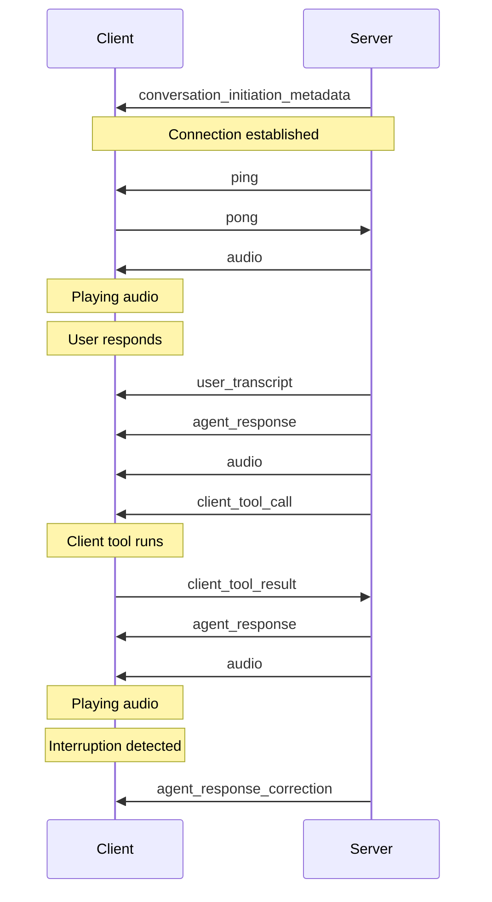

<div style={{ position: 'relative', width: '100%', paddingBottom: '56.25%' }}>
  <iframe
    src="https://player.vimeo.com/video/1029660636"
    frameBorder="0"
    style={{ position: 'absolute', top: '0', left: '0', width: '100%', height: '100%' }}
    className="aspect-video w-full rounded-lg"
    allow="autoplay; fullscreen; picture-in-picture"
    allowFullScreen
  />
</div>

## What is Conversational AI?

ElevenLabs [Conversational AI](https://elevenlabs.io/conversational-ai) is a platform for deploying customized, conversational voice agents. Built in response to our customers' needs, our platform eliminates months of development time typically spent building conversation stacks from scratch. It combines these building blocks:

<CardGroup cols={2}>
  <Card title="Speech to text">
    Our fine tuned ASR model that transcribes the caller's dialogue.
  </Card>
  <Card title="Language model">
    Choose from Gemini, Claude, OpenAI and more, or bring your own.
  </Card>
  <Card title="Text to speech">
    Our low latency, human-like TTS across 5k+ voices and 31 languages.
  </Card>
  <Card title="Turn taking model">
    Our custom turn taking model that understands when to speak, like a human would.
  </Card>
</CardGroup>

Altogether it is a highly composable AI Voice agent solution that can scale to thousands of calls per day. With [server](/docs/conversational-ai/customization/tools/server-tools) & [client side](/docs/conversational-ai/customization/tools/client-tools) tools, [knowledge](/docs/conversational-ai/customization/knowledge-base) bases, [dynamic](/docs/conversational-ai/customization/personalization/dynamic-variables) agent instantiation and [overrides](/docs/conversational-ai/customization/personalization/overrides), plus built-in monitoring, it's the complete developer toolkit.

<Card title="Pricing" horizontal>
  15 minutes to get started on the free plan. Get 13,750 minutes included on the Business plan at
  \$0.08 per minute on the Business plan, with extra minutes billed at \$0.08, as well as
  significantly discounted pricing at higher volumes.
  <br />
  **Setup & Prompt Testing**: billed at half the cost.
</Card>

<Note>
  Usage is billed to the account that created the agent. If authentication is not enabled, anybody
  with your agent's id can connect to it and consume your credits. To protect against this, either
  enable authentication for your agent or handle the agent id as a secret.
</Note>

## Pricing tiers

<Tabs>
  <Tab title="In Minutes">
  
  | Tier     | Price   | Minutes included | Cost per extra minute              |
  | -------- | ------- | ---------------- | ---------------------------------- |
  | Free     | \$0     | 15               | Unavailable                        |
  | Starter  | \$5     | 50               | Unavailable                        |
  | Creator  | \$22    | 250              | ~\$0.12                            |
  | Pro      | \$99    | 1100             | ~\$0.11                            |
  | Scale    | \$330   | 3,600            | ~\$0.10                            |
  | Business | \$1,320 | 13,750           | \$0.08 (annual), \$0.096 (monthly) |

  </Tab>
  <Tab title="In Credits">
  
  | Tier     | Price   | Credits included | Cost in credits per extra minute |
  | -------- | ------- | ---------------- | -------------------------------- |
  | Free     | \$0     | 10,000           | Unavailable                      |
  | Starter  | \$5     | 30,000           | Unavailable                      |
  | Creator  | \$22    | 100,000          | 400                              |
  | Pro      | \$99    | 500,000          | 454                              |
  | Scale    | \$330   | 2,000,000        | 555                              |
  | Business | \$1,320 | 11,000,000       | 800                              |

  </Tab>
</Tabs>

In multimodal text + voice mode, text message pricing per message. LLM costs are passed through separately, see here for estimates of [LLM cost](/docs/conversational-ai/customization/llm#supported-llms).

| Plan       | Price per text message |
| ---------- | ---------------------- |
| Free       | 0.4 cents              |
| Starter    | 0.4 cents              |
| Creator    | 0.3 cents              |
| Pro        | 0.3 cents              |
| Scale      | 0.3 cents              |
| Business   | 0.3 cents              |
| Enterprise | Custom pricing         |

### Pricing during silent periods

When a conversation is silent for longer than ten seconds, ElevenLabs reduces the inference of the turn-taking model and speech-to-text services until voice activity is detected again. This optimization means that extended periods of silence are charged at 5% of the usual per-minute cost.

This reduction in cost:

- Only applies to the period of silence.
- Does not apply after voice activity is detected again.
- Can be triggered at multiple times in the same conversation.

## Models

Currently, the following models are natively supported and can be configured via the agent settings:

| Provider      | Model                 |
| ------------- | --------------------- |
| **Google**    | Gemini 2.5 Flash      |
|               | Gemini 2.0 Flash      |
|               | Gemini 2.0 Flash Lite |
|               | Gemini 1.5 Flash      |
|               | Gemini 1.5 Pro        |
| **OpenAI**    | GPT-4.1               |
|               | GPT-4.1 Mini          |
|               | GPT-4.1 Nano          |
|               | GPT-4o                |
|               | GPT-4o Mini           |
|               | GPT-4 Turbo           |
|               | GPT-4                 |
|               | GPT-3.5 Turbo         |
| **Anthropic** | Claude Sonnet 4       |
|               | Claude 3.5 Sonnet     |
|               | Claude 3.5 Sonnet v1  |
|               | Claude 3.7 Sonnet     |
|               | Claude 3.0 Haiku      |

Using your own Custom LLM is also supported by specifying the endpoint we should make requests to and providing credentials through our secure secret storage.

<Note>
  With EU data residency enabled, a small number of older Gemini and Claude LLMs are not available
  in Conversational AI to maintain compliance with EU data residency. Custom LLMs and OpenAI LLMs
  remain fully available. For more infomation please see [GDPR and data
  residency](/docs/conversational-ai/legal/gdpr).
</Note>


You can start with our [free tier](https://elevenlabs.io/app/sign-up), which includes 15 minutes of conversation per month.

Need more? Upgrade to a [paid plan](https://elevenlabs.io/pricing/api) instantly - no sales calls required. For enterprise usage (6+ hours of daily conversation), [contact our sales team](https://elevenlabs.io/contact-sales) for custom pricing tailored to your needs.

## Popular applications

Companies and creators use our Conversational AI orchestration platform to create:

- **Customer service**: Assistants trained on company documentation that can handle customer queries, troubleshoot issues, and provide 24/7 support in multiple languages.
- **Virtual assistants**: Assistants trained to manage scheduling, set reminders, look up information, and help users stay organized throughout their day.
- **Retail support**: Assistants that help customers find products, provide personalized recommendations, track orders, and answer product-specific questions.
- **Personalized learning**: Assistants that help students learn new topics & enhance reading comprehension by speaking with books and [articles](https://elevenlabs.io/blog/time-brings-conversational-ai-to-journalism).
- **Multi-character storytelling**: Interactive narratives with distinct voices for different characters, powered by our new [multi-voice support](/docs/conversational-ai/customization/voice/multi-voice-support) feature.

<Note>
  Ready to get started? Check out our [quickstart guide](/docs/conversational-ai/quickstart) to
  create your first AI agent in minutes.
</Note>

## FAQ

<AccordionGroup>
  <Accordion title="Concurrency limits">
Plan limits

Your subscription plan determines how many calls can be made simultaneously.

| Plan       | Concurrency limit |
| ---------- | ----------------- |
| Free       | 4                 |
| Starter    | 6                 |
| Creator    | 10                |
| Pro        | 20                |
| Scale      | 30                |
| Business   | 30                |
| Enterprise | Elevated          |

    <Note>
      To increase your concurrency limit [upgrade your subscription plan](https://elevenlabs.io/pricing/api)
      or [contact sales](https://elevenlabs.io/contact-sales) to discuss enterprise plans.
    </Note>

  </Accordion>
  <Accordion title="Supported audio formats">
    The following audio output formats are supported in the Conversational AI platform:

    - PCM (8 kHz / 16 kHz / 22.05 kHz / 24 kHz / 44.1 kHz)
    - μ-law 8000Hz

  </Accordion>
</AccordionGroup>

---
title: Quickstart
subtitle: Build your first conversational AI voice agent in 5 minutes.
---

In this guide, you'll learn how to create your first Conversational AI voice agent. This will serve as a foundation for building conversational workflows tailored to your business use cases.

## Getting started

Conversational AI agents are managed through the [ElevenLabs dashboard](https://elevenlabs.io/app/conversational-ai). This is used to:

- Create and manage AI assistants
- Configure voice settings and conversation parameters
- Equip the agent with [tools](/docs/conversational-ai/customization/tools) and a [knowledge base](/docs/conversational-ai/customization/knowledge-base)
- Review conversation analytics and transcripts
- Manage API keys and integration settings

<Note>
  The web dashboard uses our [Web SDK](/docs/conversational-ai/libraries/react) under the hood to
  handle real-time conversations.
</Note>

<Tabs>
  <Tab title="Build a support agent">
    ## Overview
    
    In this guide, we'll create a conversational support assistant capable of answering questions about your product, documentation, or service. This assistant can be embedded into your website or app to provide real-time support to your customers.
    
    <Frame
      caption="The assistant at the bottom right corner of this page is capable of answering questions about ElevenLabs, navigating pages & taking you to external resources."
      background="subtle"
    >
      
    </Frame>
    
    ### Prerequisites
    
    - An [ElevenLabs account](https://www.elevenlabs.io)
    
    ### Assistant setup
    
    <Steps>
      <Step title="Sign in to ElevenLabs">
        Go to [elevenlabs.io](https://elevenlabs.io/sign-up) and sign in to your account.
      </Step>
      <Step title="Create a new assistant">
        In the **ElevenLabs Dashboard**, create a new assistant by entering a name and selecting the `Blank template` option.
        <Frame caption="Creating a new assistant" background="subtle">
          
        </Frame>
      </Step>
      <Step title="Configure the assistant behavior">
       Go to the **Agent** tab to configure the assistant's behavior. Set the following:
        <Steps>
          <Step title="First message">
            This is the first message the assistant will speak out loud when a user starts a conversation.
    
            ```plaintext First message
            Hi, this is Alexis from <company name> support. How can I help you today?
            ```
          </Step>
          <Step title="System prompt">
            This prompt guides the assistant's behavior, tasks, and personality.
    
            Customize the following example with your company details:
            ```plaintext System prompt
            You are a friendly and efficient virtual assistant for [Your Company Name]. Your role is to assist customers by answering questions about the company's products, services, and documentation. You should use the provided knowledge base to offer accurate and helpful responses.
    
            Tasks:
            - Answer Questions: Provide clear and concise answers based on the available information.
            - Clarify Unclear Requests: Politely ask for more details if the customer's question is not clear.
    
            Guidelines:
            - Maintain a friendly and professional tone throughout the conversation.
            - Be patient and attentive to the customer's needs.
            - If unsure about any information, politely ask the customer to repeat or clarify.
            - Avoid discussing topics unrelated to the company's products or services.
            - Aim to provide concise answers. Limit responses to a couple of sentences and let the user guide you on where to provide more detail.
            ```
          </Step>
        </Steps>
    
      </Step>
      <Step title="Add a knowledge base">
        Go to the **Knowledge Base** section to provide your assistant with context about your business. 
        
        This is where you can upload relevant documents & links to external resources:
    
        - Include documentation, FAQs, and other resources to help the assistant respond to customer inquiries.
        - Keep the knowledge base up-to-date to ensure the assistant provides accurate and current information.
    
      </Step>
    </Steps>
    
    ### Configure the voice
    
    <Steps>
      <Step title="Select a voice">
        In the **Voice** tab, choose a voice that best matches your assistant from the [voice library](https://elevenlabs.io/community):
        <Frame background="subtle">
          
        </Frame>
       <Note> Using higher quality voices, models, and LLMs may increase response time. For an optimal customer experience, balance quality and latency based on your assistant's expected use case.</Note>
    
      </Step>
      <Step title="Testing your assistant">
         Press the **Test AI agent** button and try conversing with your assistant.
      </Step>
    </Steps>
    
    ### Analyze and collect conversation data
    
    Configure evaluation criteria and data collection to analyze conversations and improve your assistant's performance.
    
    <Steps>
      <Step title="Configure evaluation criteria">
        Navigate to the **Analysis** tab in your assistant's settings to define custom criteria for evaluating conversations.
    
        <Frame background="subtle">
          
        </Frame>
    
        Every conversation transcript is passed to the LLM to verify if specific goals were met. Results will either be `success`, `failure`, or `unknown`, along with a rationale explaining the chosen result.
    
        Let's add an evaluation criteria with the name `solved_user_inquiry`:
    
        ```plaintext Prompt
        The assistant was able to answer all of the queries or redirect them to a relevant support channel.
    
        Success Criteria:
        - All user queries were answered satisfactorily.
        - The user was redirected to a relevant support channel if needed.
        ```
    
      </Step>
    
      <Step title="Configure data collection">
        In the **Data Collection** section, configure details to be extracted from each conversation.
    
        Click **Add item** and configure the following:
    
        1. **Data type:** Select "string"
        2. **Identifier:** Enter a unique identifier for this data point: `user_question`
        3. **Description:** Provide detailed instructions for the LLM about how to extract the specific data from the transcript:
    
        ```plaintext Prompt
        Extract the user's questions & inquiries from the conversation.
        ```
        <Tip>Test your assistant by posing as a customer. Ask questions, evaluate its responses, and tweak the prompts until you're happy with how it performs.</Tip>
    
      </Step>
      <Step title="View conversation history">
        View evaluation results and collected data for each conversation in the **Call history** tab.
        <Frame background="subtle">
          
        </Frame>
        <Tip>Regularly review conversation history to identify common issues and patterns.</Tip>
      </Step>
    </Steps>
    
    Your assistant is now configured. Embed the widget on your website to start providing real-time support to your customers.
    
  </Tab>
  <Tab title="Build a restaurant ordering agent">
    ## Overview
    
    In this guide, we’ll create a conversational ordering assistant for Pierogi Palace, a Polish restaurant that takes food orders, addressing their challenge of managing high call volumes.
    
    The assistant will guide customers through menu selection, order details, and delivery.
    
    ### Prerequisites
    
    - An [ElevenLabs account](https://www.elevenlabs.io)
    
    ### Assistant setup
    
    <Steps>
      <Step title="Sign in to ElevenLabs">
        Go to [elevenlabs.io](https://elevenlabs.io/sign-up) and sign in to your account.
      </Step>
      <Step title="Create a new assistant">
        In the **ElevenLabs Dashboard**, create a new assistant by entering a name and selecting the `Blank template` option.
        <Frame caption="Creating a new assistant" background="subtle">
          
        </Frame>
      </Step>
      <Step title="Configure the assistant behavior">
       Go to the **Agent** tab to configure the assistant's behavior. Set the following:
        <Steps>
          <Step title="First message">
            This is the first message the assistant will speak out loud when a user starts a conversation.
    
            ```plaintext First message
            Welcome to Pierogi Palace! I'm here to help you place your order. What can I get started for you today?
            ```
          </Step>
          <Step title="System prompt">
            This prompt guides the assistant's behavior, tasks, and personality:
    
            ```plaintext System prompt
            You are a friendly and efficient virtual assistant for Pierogi Palace, a modern Polish restaurant specializing in pierogi. It is located in the Zakopane mountains in Poland.
            Your role is to help customers place orders over voice conversations. You have comprehensive knowledge of the menu items and their prices.
    
            Menu Items:
    
            - Potato & Cheese Pierogi – 30 Polish złoty per dozen
            - Beef & Onion Pierogi – 40 Polish złoty per dozen
            - Spinach & Feta Pierogi – 30 Polish złoty per dozen
    
            Your Tasks:
    
            1. Greet the Customer: Start with a warm welcome and ask how you can assist.
            2. Take the Order: Listen carefully to the customer's selection, confirm the type and quantity of pierogi.
            3. Confirm Order Details: Repeat the order back to the customer for confirmation.
            4. Calculate Total Price: Compute the total cost based on the items ordered.
            5. Collect Delivery Information: Ask for the customer's delivery address to estimate delivery time.
            6. Estimate Delivery Time: Inform the customer that cooking time is 10 minutes plus delivery time based on their location.
            7. Provide Order Summary: Give the customer a summary of their order, total price, and estimated delivery time.
            8. Close the Conversation: Thank the customer and let them know their order is being prepared.
    
            Guidelines:
    
            - Use a friendly and professional tone throughout the conversation.
            - Be patient and attentive to the customer's needs.
            - If unsure about any information, politely ask the customer to repeat or clarify.
            - Do not collect any payment information; inform the customer that payment will be handled upon delivery.
            - Avoid discussing topics unrelated to taking and managing the order.
            ```
          </Step>
        </Steps>
    
      </Step>
    </Steps>
    
    ### Configure the voice
    
    <Steps>
      <Step title="Select a voice">
        In the **Voice** tab, choose a voice that best matches your assistant from the [voice library](https://elevenlabs.io/community):
        <Frame background="subtle">
          
        </Frame>
       <Note> Using higher quality voices, models, and LLMs may increase response time. For an optimal customer experience, balance quality and latency based on your assistant's expected use case.</Note>
    
      </Step>
      <Step title="Testing your assistant">
         Press the **Test AI agent** button and try ordering some pierogi.
      </Step>
    </Steps>
    
    ### Analyze and collect conversation data
    
    Configure evaluation criteria and data collection to analyze conversations and improve your assistant's performance.
    
    <Steps>
      <Step title="Configure evaluation criteria">
        Navigate to the **Analysis** tab in your assistant's settings to define custom criteria for evaluating conversations.
    
        <Frame background="subtle">
          
        </Frame>
    
        Every conversation transcript is passed to the LLM to verify if specific goals were met. Results will either be `success`, `failure`, or `unknown`, along with a rationale explaining the chosen result.
    
        Let's add an evaluation criteria with the name `order_completion`:
    
        ```plaintext Prompt
        Evaluate if the conversation resulted in a successful order.
        Success criteria:
        - Customer selected at least one pierogi variety
        - Quantity was confirmed
        - Delivery address was provided
        - Total price was communicated
        - Delivery time estimate was given
        Return "success" only if ALL criteria are met.
        ```
    
      </Step>
    
      <Step title="Configure data collection">
        In the **Data Collection** section, configure details to be extracted from each conversation.
    
        Click **Add item** and configure the following:
    
        1. **Data type:** Select "string"
        2. **Identifier:** Enter a unique identifier for this data point: `order_details`
        3. **Description:** Provide detailed instructions for the LLM about how to extract the specific data from the transcript:
    
        ```plaintext Prompt
        Extract order details from the conversation, including:
        - Type of order (delivery, pickup, inquiry_only)
        - List of pierogi varieties and quantities ordered in the format: "item: quantity"
        - Delivery zone based on the address (central_zakopane, outer_zakopane, outside_delivery_zone)
        - Interaction type (completed_order, abandoned_order, menu_inquiry, general_inquiry)
        If no order was placed, return "none"
        ```
        <Tip>Test your assistant by posing as a customer. Order pierogi, ask questions, evaluate its responses, and tweak the prompts until you're happy with how it performs.</Tip>
    
      </Step>
      <Step title="View conversation history">
        View evaluation results and collected data for each conversation in the **Call history** tab.
        <Frame background="subtle">
          
        </Frame>
        <Tip>Regularly review conversation history to identify common issues and patterns.</Tip>
      </Step>
    </Steps>
    
    Your assistant is now configured & ready to take orders.
    
  </Tab>
</Tabs>

## Next steps

<CardGroup cols={2}>

<Card title="Customize your agent" href="/docs/conversational-ai/customization">
  Learn how to customize your agent with tools, knowledge bases, dynamic variables and overrides.
</Card>

<Card title="Integration quickstart" href="/docs/conversational-ai/guides/quickstarts">
  Learn how to integrate Conversational AI into your app using the SDK for advanced configuration.
</Card>

</CardGroup>

---
title: Conversational AI dashboard
subtitle: Monitor and analyze your agents' performance effortlessly.
---

## Overview

The Agents Dashboard provides real-time insights into your Conversational AI agents. It displays performance metrics over customizable time periods. You can review data for individual agents or across your entire workspace.

## Analytics

You can monitor activity over various daily, weekly, and monthly time periods.

<Frame caption="Dashboard view for Last Day" background="subtle">
  
</Frame>

<Frame caption="Dashboard view for Last Month" background="subtle">
  
</Frame>

The dashboard can be toggled to show different metrics, including: number of calls, average duration, total cost, and average cost.

## Language Breakdown

A key benefit of Conversational AI is the ability to support multiple languages.
The Language Breakdown section shows the percentage of calls (overall, or per-agent) in each language.

<Frame caption="Language Breakdown" background="subtle">
  
</Frame>

## Active Calls

At the top left of the dashboard, the current number of active calls is displayed. This real-time counter reflects ongoing sessions for your workspace's agents, and is also accessible via the API.

---
title: Client tools
subtitle: Empower your assistant to trigger client-side operations.
---

**Client tools** enable your assistant to execute client-side functions. Unlike [server-side tools](/docs/conversational-ai/customization/tools), client tools allow the assistant to perform actions such as triggering browser events, running client-side functions, or sending notifications to a UI.

## Overview

Applications may require assistants to interact directly with the user's environment. Client-side tools give your assistant the ability to perform client-side operations.

Here are a few examples where client tools can be useful:

- **Triggering UI events**: Allow an assistant to trigger browser events, such as alerts, modals or notifications.
- **Interacting with the DOM**: Enable an assistant to manipulate the Document Object Model (DOM) for dynamic content updates or to guide users through complex interfaces.

<Info>
  To perform operations server-side, use
  [server-tools](/docs/conversational-ai/customization/tools/server-tools) instead.
</Info>

## Guide

### Prerequisites

- An [ElevenLabs account](https://elevenlabs.io)
- A configured ElevenLabs Conversational Agent ([create one here](https://elevenlabs.io/app/conversational-ai))

<Steps>
  <Step title="Create a new client-side tool">
    Navigate to your agent dashboard. In the **Tools** section, click **Add Tool**. Ensure the **Tool Type** is set to **Client**. Then configure the following:

| Setting     | Parameter                                                        |
| ----------- | ---------------------------------------------------------------- |
| Name        | logMessage                                                       |
| Description | Use this client-side tool to log a message to the user's client. |

Then create a new parameter `message` with the following configuration:

| Setting     | Parameter                                                                          |
| ----------- | ---------------------------------------------------------------------------------- |
| Data Type   | String                                                                             |
| Identifier  | message                                                                            |
| Required    | true                                                                               |
| Description | The message to log in the console. Ensure the message is informative and relevant. |

    <Frame background="subtle">
      
    </Frame>

  </Step>

  <Step title="Register the client tool in your code">
    Unlike server-side tools, client tools need to be registered in your code.

    Use the following code to register the client tool:

    <CodeBlocks>

      ```python title="Python" focus={4-16}
      from elevenlabs import ElevenLabs
      from elevenlabs.conversational_ai.conversation import Conversation, ClientTools

      def log_message(parameters):
          message = parameters.get("message")
          print(message)

      client_tools = ClientTools()
      client_tools.register("logMessage", log_message)

      conversation = Conversation(
          client=ElevenLabs(api_key="your-api-key"),
          agent_id="your-agent-id",
          client_tools=client_tools,
          # ...
      )

      conversation.start_session()
      ```

      ```javascript title="JavaScript" focus={2-10}
      // ...
      const conversation = await Conversation.startSession({
        // ...
        clientTools: {
          logMessage: async ({message}) => {
            console.log(message);
          }
        },
        // ...
      });
      ```

      ```swift title="Swift" focus={2-10}
      // ...
      var clientTools = ElevenLabsSDK.ClientTools()

      clientTools.register("logMessage") { parameters async throws -> String? in
          guard let message = parameters["message"] as? String else {
              throw ElevenLabsSDK.ClientToolError.invalidParameters
          }
          print(message)
          return message
      }
      ```
    </CodeBlocks>

    <Note>
    The tool and parameter names in the agent configuration are case-sensitive and **must** match those registered in your code.
    </Note>

  </Step>

  <Step title="Testing">
    Initiate a conversation with your agent and say something like:

    > _Log a message to the console that says Hello World_

    You should see a `Hello World` log appear in your console.

  </Step>

  <Step title="Next steps">
    Now that you've set up a basic client-side event, you can:

    - Explore more complex client tools like opening modals, navigating to pages, or interacting with the DOM.
    - Combine client tools with server-side webhooks for full-stack interactions.
    - Use client tools to enhance user engagement and provide real-time feedback during conversations.

  </Step>
</Steps>

### Passing client tool results to the conversation context

When you want your agent to receive data back from a client tool, ensure that you tick the **Wait for response** option in the tool configuration.

<Frame background="subtle">
  
</Frame>

Once the client tool is added, when the function is called the agent will wait for its response and append the response to the conversation context.

<CodeBlocks>
    ```python title="Python"
    def get_customer_details():
        # Fetch customer details (e.g., from an API or database)
        customer_data = {
            "id": 123,
            "name": "Alice",
            "subscription": "Pro"
        }
        # Return the customer data; it can also be a JSON string if needed.
        return customer_data

    client_tools = ClientTools()
    client_tools.register("getCustomerDetails", get_customer_details)

    conversation = Conversation(
        client=ElevenLabs(api_key="your-api-key"),
        agent_id="your-agent-id",
        client_tools=client_tools,
        # ...
    )

    conversation.start_session()
    ```

    ```javascript title="JavaScript"
    const clientTools = {
      getCustomerDetails: async () => {
        // Fetch customer details (e.g., from an API)
        const customerData = {
          id: 123,
          name: "Alice",
          subscription: "Pro"
        };
        // Return data directly to the agent.
        return customerData;
      }
    };

    // Start the conversation with client tools configured.
    const conversation = await Conversation.startSession({ clientTools });
    ```

</CodeBlocks>

In this example, when the agent calls **getCustomerDetails**, the function will execute on the client and the agent will receive the returned data, which is then used as part of the conversation context.

### Troubleshooting

<AccordionGroup>
  <Accordion title="Tools not being triggered">
  
    - Ensure the tool and parameter names in the agent configuration match those registered in your code.
    - View the conversation transcript in the agent dashboard to verify the tool is being executed.

  </Accordion>
  <Accordion title="Console errors">

    - Open the browser console to check for any errors.
    - Ensure that your code has necessary error handling for undefined or unexpected parameters.

  </Accordion>
</AccordionGroup>

## Best practices

<h4>Name tools intuitively, with detailed descriptions</h4>

If you find the assistant does not make calls to the correct tools, you may need to update your tool names and descriptions so the assistant more clearly understands when it should select each tool. Avoid using abbreviations or acronyms to shorten tool and argument names.

You can also include detailed descriptions for when a tool should be called. For complex tools, you should include descriptions for each of the arguments to help the assistant know what it needs to ask the user to collect that argument.

<h4>Name tool parameters intuitively, with detailed descriptions</h4>

Use clear and descriptive names for tool parameters. If applicable, specify the expected format for a parameter in the description (e.g., YYYY-mm-dd or dd/mm/yy for a date).

<h4>
  Consider providing additional information about how and when to call tools in your assistant's
  system prompt
</h4>

Providing clear instructions in your system prompt can significantly improve the assistant's tool calling accuracy. For example, guide the assistant with instructions like the following:

```plaintext
Use `check_order_status` when the user inquires about the status of their order, such as 'Where is my order?' or 'Has my order shipped yet?'.
```

Provide context for complex scenarios. For example:

```plaintext
Before scheduling a meeting with `schedule_meeting`, check the user's calendar for availability using check_availability to avoid conflicts.
```

<h4>LLM selection</h4>

<Warning>
  When using tools, we recommend picking high intelligence models like GPT-4o mini or Claude 3.5
  Sonnet and avoiding Gemini 1.5 Flash.
</Warning>

It's important to note that the choice of LLM matters to the success of function calls. Some LLMs can struggle with extracting the relevant parameters from the conversation.

---
title: Server tools
subtitle: Connect your assistant to external data & systems.
---

**Tools** enable your assistant to connect to external data and systems. You can define a set of tools that the assistant has access to, and the assistant will use them where appropriate based on the conversation.

## Overview

Many applications require assistants to call external APIs to get real-time information. Tools give your assistant the ability to make external function calls to third party apps so you can get real-time information.

Here are a few examples where tools can be useful:

- **Fetching data**: enable an assistant to retrieve real-time data from any REST-enabled database or 3rd party integration before responding to the user.
- **Taking action**: allow an assistant to trigger authenticated actions based on the conversation, like scheduling meetings or initiating order returns.

<Info>
  To interact with Application UIs or trigger client-side events use [client
  tools](/docs/conversational-ai/customization/tools/client-tools) instead.
</Info>

## Tool configuration

Conversational AI assistants can be equipped with tools to interact with external APIs. Unlike traditional requests, the assistant generates query, body, and path parameters dynamically based on the conversation and parameter descriptions you provide.

All tool configurations and parameter descriptions help the assistant determine **when** and **how** to use these tools. To orchestrate tool usage effectively, update the assistant’s system prompt to specify the sequence and logic for making these calls. This includes:

- **Which tool** to use and under what conditions.
- **What parameters** the tool needs to function properly.
- **How to handle** the responses.

<br />

<Tabs>

<Tab title="Configuration">
Define a high-level `Name` and `Description` to describe the tool's purpose. This helps the LLM understand the tool and know when to call it.

<Info>
  If the API requires path parameters, include variables in the URL path by wrapping them in curly
  braces `{}`, for example: `/api/resource/{id}` where `id` is a path parameter.
</Info>

<Frame background="subtle">
  
</Frame>

</Tab>

<Tab title="Secrets">

Assistant secrets can be used to add authentication headers to requests.

<Frame background="subtle">
  
</Frame>

</Tab>

<Tab title="Headers">

Specify any headers that need to be included in the request.

<Frame background="subtle"></Frame>

</Tab>

<Tab title="Path parameters">

Include variables in the URL path by wrapping them in curly braces `{}`:

- **Example**: `/api/resource/{id}` where `id` is a path parameter.

<Frame background="subtle">
  
</Frame>

</Tab>

<Tab title="Body parameters">

Specify any body parameters to be included in the request.

<Frame background="subtle">
  
</Frame>

</Tab>

<Tab title="Query parameters">

Specify any query parameters to be included in the request.

<Frame background="subtle">
  
</Frame>

</Tab>

</Tabs>

## Guide

In this guide, we'll create a weather assistant that can provide real-time weather information for any location. The assistant will use its geographic knowledge to convert location names into coordinates and fetch accurate weather data.

<div style="padding:104.25% 0 0 0;position:relative;">
  <iframe
    src="https://player.vimeo.com/video/1061374724?h=bd9bdb535e&amp;badge=0&amp;autopause=0&amp;player_id=0&amp;app_id=58479"
    frameborder="0"
    allow="autoplay; fullscreen; picture-in-picture; clipboard-write; encrypted-media"
    style="position:absolute;top:0;left:0;width:100%;height:100%;"
    title="weatheragent"
  ></iframe>
</div>
<script src="https://player.vimeo.com/api/player.js"></script>

<Steps>
  <Step title="Configure the weather tool">
    First, on the **Agent** section of your agent settings page, choose **Add Tool**. Select **Webhook** as the Tool Type, then configure the weather API integration:

    <AccordionGroup>
      <Accordion title="Weather Tool Configuration">

      <Tabs>
        <Tab title="Configuration">

        | Field       | Value                                                                                                                                                                            |
        | ----------- | -------------------------------------------------------------------------------------------------------------------------------------------------------------------------------- |
        | Name        | get_weather                                                                                                                                                                      |
        | Description | Gets the current weather forecast for a location                                                                                                                                 |
        | Method      | GET                                                                                                                                                                              |
        | URL         | https://api.open-meteo.com/v1/forecast?latitude={latitude}&longitude={longitude}&current=temperature_2m,wind_speed_10m&hourly=temperature_2m,relative_humidity_2m,wind_speed_10m |

        </Tab>

        <Tab title="Path Parameters">

        | Data Type | Identifier | Value Type | Description                                         |
        | --------- | ---------- | ---------- | --------------------------------------------------- |
        | string    | latitude   | LLM Prompt | The latitude coordinate for the requested location  |
        | string    | longitude  | LLM Prompt | The longitude coordinate for the requested location |

        </Tab>

      </Tabs>

      </Accordion>
    </AccordionGroup>

    <Warning>
      An API key is not required for this tool. If one is required, this should be passed in the headers and stored as a secret.
    </Warning>

  </Step>

  <Step title="Orchestration">
    Configure your assistant to handle weather queries intelligently with this system prompt:

    ```plaintext System prompt
    You are a helpful conversational AI assistant with access to a weather tool. When users ask about
    weather conditions, use the get_weather tool to fetch accurate, real-time data. The tool requires
    a latitude and longitude - use your geographic knowledge to convert location names to coordinates
    accurately.

    Never ask users for coordinates - you must determine these yourself. Always report weather
    information conversationally, referring to locations by name only. For weather requests:

    1. Extract the location from the user's message
    2. Convert the location to coordinates and call get_weather
    3. Present the information naturally and helpfully

    For non-weather queries, provide friendly assistance within your knowledge boundaries. Always be
    concise, accurate, and helpful.

    First message: "Hey, how can I help you today?"
    ```

    <Success>
      Test your assistant by asking about the weather in different locations. The assistant should
      handle specific locations ("What's the weather in Tokyo?") and ask for clarification after general queries ("How's
      the weather looking today?").
    </Success>

  </Step>
</Steps>

## Best practices

<h4>Name tools intuitively, with detailed descriptions</h4>

If you find the assistant does not make calls to the correct tools, you may need to update your tool names and descriptions so the assistant more clearly understands when it should select each tool. Avoid using abbreviations or acronyms to shorten tool and argument names.

You can also include detailed descriptions for when a tool should be called. For complex tools, you should include descriptions for each of the arguments to help the assistant know what it needs to ask the user to collect that argument.

<h4>Name tool parameters intuitively, with detailed descriptions</h4>

Use clear and descriptive names for tool parameters. If applicable, specify the expected format for a parameter in the description (e.g., YYYY-mm-dd or dd/mm/yy for a date).

<h4>
  Consider providing additional information about how and when to call tools in your assistant's
  system prompt
</h4>

Providing clear instructions in your system prompt can significantly improve the assistant's tool calling accuracy. For example, guide the assistant with instructions like the following:

```plaintext
Use `check_order_status` when the user inquires about the status of their order, such as 'Where is my order?' or 'Has my order shipped yet?'.
```

Provide context for complex scenarios. For example:

```plaintext
Before scheduling a meeting with `schedule_meeting`, check the user's calendar for availability using check_availability to avoid conflicts.
```

<h4>LLM selection</h4>

<Warning>
  When using tools, we recommend picking high intelligence models like GPT-4o mini or Claude 3.5
  Sonnet and avoiding Gemini 1.5 Flash.
</Warning>

It's important to note that the choice of LLM matters to the success of function calls. Some LLMs can struggle with extracting the relevant parameters from the conversation.

---
title: Agent tools deprecation
subtitle: Migrate from legacy `prompt.tools` to the new `prompt.tool_ids` field.
---

## Overview

<Info>The way you wire tools into your ConvAI agents is getting a refresh.</Info>

### What's changing?

- The old request field `body.conversation_config.agent.prompt.tools` is **deprecated**.
- Use `body.conversation_config.agent.prompt.tool_ids` to list the IDs of the client or server tools your agent should use.
- **New field** `prompt.built_in_tools` is introduced for **system tools** (e.g., `end_call`, `language_detection`). These tools are referenced by **name**, not by ID.

### Critical deadlines

<Check>
  **July 14, 2025** - Last day for full backwards compatibility. You can continue using
  `prompt.tools` until this date.
</Check>

<Note>
  **July 15, 2025** - GET endpoints will stop returning the `tools` field. Only `prompt.tool_ids`
  will be included in responses.
</Note>

<Warning>
  **July 23, 2025** - Legacy `prompt.tools` field will be permanently removed. All requests
  containing this field will be rejected.
</Warning>

## Why the change?

Decoupling tools from agents brings several advantages:

- **Re-use** – the same tool can be shared across multiple agents.
- **Simpler audits** – inspect, update or delete a tool in one place.
- **Cleaner payloads** – agent configurations stay lightweight.

## What has already happened?

<Check>
  Good news — we've already migrated your data! Every tool that previously lived in `prompt.tools`
  now exists as a standalone record, and its ID is present in the agent's `prompt.tool_ids` array.
  No scripts required.
</Check>

We have **automatically migrated all existing data**:

- Every tool that was previously in an agent's `prompt.tools` array now exists as a standalone record.
- The agent's `prompt.tool_ids` array already references those new tool records.

No one-off scripts are required — your agents continue to work unchanged.

## Deprecation timeline

| Date              | Status                   | Behaviour                                                                        |
| ----------------- | ------------------------ | -------------------------------------------------------------------------------- |
| **July 14, 2025** | ✅ Full compatibility    | You may keep sending `prompt.tools`. GET responses include the `tools` field.    |
| **July 15, 2025** | ⚠️ Partial compatibility | GET endpoints stop returning the `tools` field. Only `prompt.tool_ids` included. |
| **July 23, 2025** | ❌ No compatibility      | POST and PATCH endpoints **reject** any request containing `prompt.tools`.       |

## Toolbox endpoint

All tool management lives under a dedicated endpoint:

```http title="Tool management"
POST | GET | PATCH | DELETE  https://api.elevenlabs.io/v1/convai/tools
```

Use it to:

- **Create** a tool and obtain its ID.
- **Update** it when requirements change.
- **Delete** it when it is no longer needed.

Anything that once sat in the old `tools` array now belongs here.

## Migration guide

<Error>
  System tools are **not** supported in `prompt.tool_ids`. Instead, specify them in the **new**
  `prompt.built_in_tools` field.
</Error>

If you are still using the legacy field, follow the steps below.

<Steps>
  ### 1. Stop sending `prompt.tools`
  Remove the `tools` array from your agent configuration.

### 2. Send the tool IDs instead

Replace it with `prompt.tool_ids`, containing the IDs of the client or server tools the agent
should use.

### 3. (Optional) Clean up

After 23 July, delete any unused standalone tools via the toolbox endpoint.

</Steps>

## Example payloads

<Note>
  A request must include **either** `prompt.tool_ids` **or** the legacy `prompt.tools` array —
  **never both**. Sending both fields results in an error.
</Note>

<CodeBlocks>
```json title="Legacy format (deprecated)"
{
  "conversation_config": {
    "agent": {
      "prompt": {
        "tools": [
          {
            "type": "client", 
            "name": "open_url",
            "description": "Open a provided URL in the user's browser."
          },
          {
            "type": "system",
            "name": "end_call", 
            "description": "",
            "response_timeout_secs": 20,
            "params": {
              "system_tool_type": "end_call"
            }
          }
        ]
      }
    }
  }
}
```

```json title="New format (recommended) – client tool via ID + system tool"
{
  "conversation_config": {
    "agent": {
      "prompt": {
        "tool_ids": ["tool_123456789abcdef0"],
        "built_in_tools": {
          "end_call": {
            "name": "end_call",
            "description": "",
            "response_timeout_secs": 20,
            "type": "system",
            "params": {
              "system_tool_type": "end_call"
            }
          },
          "language_detection": null,
          "transfer_to_agent": null,
          "transfer_to_number": null,
          "skip_turn": null
        }
      }
    }
  }
}
```

</CodeBlocks>

## FAQ

<AccordionGroup>
  <Accordion title="Will my existing integrations break?">
    No. Until July 23, the API will silently migrate any `prompt.tools` array you send. However,
    starting July 15, GET and PATCH responses will no longer include full tool objects. After July
    23, any POST/PATCH requests containing `prompt.tools` will be rejected.
  </Accordion>
  <Accordion title="Can I mix both fields in one request?">
    No. A request must use **either** `prompt.tool_ids` **or** `prompt.tools` — never both.
  </Accordion>
  <Accordion title="How do I find a tool's ID?">
    List your tools via `GET /v1/convai/tools` or inspect the response when you create one.
  </Accordion>
</AccordionGroup>{' '}

---
title: Client events
subtitle: >-
  Understand and handle real-time events received by the client during
  conversational applications.
---

**Client events** are system-level events sent from the server to the client that facilitate real-time communication. These events deliver audio, transcription, agent responses, and other critical information to the client application.

<Note>
  For information on events you can send from the client to the server, see the [Client-to-server
  events](/docs/conversational-ai/customization/events/client-to-server-events) documentation.
</Note>

## Overview

Client events are essential for maintaining the real-time nature of conversations. They provide everything from initialization metadata to processed audio and agent responses.

<Info>
  These events are part of the WebSocket communication protocol and are automatically handled by our
  SDKs. Understanding them is crucial for advanced implementations and debugging.
</Info>

## Client event types

<AccordionGroup>
  <Accordion title="conversation_initiation_metadata">
    - Automatically sent when starting a conversation
    - Initializes conversation settings and parameters

    ```javascript
    // Example initialization metadata
    {
      "type": "conversation_initiation_metadata",
      "conversation_initiation_metadata_event": {
        "conversation_id": "conv_123",
        "agent_output_audio_format": "pcm_44100",  // TTS output format
        "user_input_audio_format": "pcm_16000"    // ASR input format
      }
    }
    ```

  </Accordion>

  <Accordion title="ping">
    - Health check event requiring immediate response
    - Automatically handled by SDK
    - Used to maintain WebSocket connection

      ```javascript
      // Example ping event structure
      {
        "ping_event": {
          "event_id": 123456,
          "ping_ms": 50  // Optional, estimated latency in milliseconds
        },
        "type": "ping"
      }
      ```

      ```javascript
      // Example ping handler
      websocket.on('ping', () => {
        websocket.send('pong');
      });
      ```

  </Accordion>

  <Accordion title="audio">
    - Contains base64 encoded audio for playback
    - Includes numeric event ID for tracking and sequencing
    - Handles voice output streaming
    
    ```javascript
    // Example audio event structure
    {
      "audio_event": {
        "audio_base_64": "base64_encoded_audio_string",
        "event_id": 12345
      },
      "type": "audio"
    }
    ```

    ```javascript
    // Example audio event handler
    websocket.on('audio', (event) => {
      const { audio_event } = event;
      const { audio_base_64, event_id } = audio_event;
      audioPlayer.play(audio_base_64);
    });
    ```

  </Accordion>

  <Accordion title="user_transcript">
    - Contains finalized speech-to-text results
    - Represents complete user utterances
    - Used for conversation history

    ```javascript
    // Example transcript event structure
    {
      "type": "user_transcript",
      "user_transcription_event": {
        "user_transcript": "Hello, how can you help me today?"
      }
    }
    ```

    ```javascript
    // Example transcript handler
    websocket.on('user_transcript', (event) => {
      const { user_transcription_event } = event;
      const { user_transcript } = user_transcription_event;
      updateConversationHistory(user_transcript);
    });
    ```

  </Accordion>

  <Accordion title="agent_response">
    - Contains complete agent message
    - Sent with first audio chunk
    - Used for display and history

    ```javascript
    // Example response event structure
    {
      "type": "agent_response",
      "agent_response_event": {
        "agent_response": "Hello, how can I assist you today?"
      }
    }
    ```

    ```javascript
    // Example response handler
    websocket.on('agent_response', (event) => {
      const { agent_response_event } = event;
      const { agent_response } = agent_response_event;
      displayAgentMessage(agent_response);
    });
    ```

  </Accordion>

  <Accordion title="agent_response_correction">
    - Contains truncated response after interruption
      - Updates displayed message
      - Maintains conversation accuracy

    ```javascript
    // Example response correction event structure
    {
      "type": "agent_response_correction",
      "agent_response_correction_event": {
        "original_agent_response": "Let me tell you about the complete history...",
        "corrected_agent_response": "Let me tell you about..."  // Truncated after interruption
      }
    }
    ```

    ```javascript
    // Example response correction handler
    websocket.on('agent_response_correction', (event) => {
      const { agent_response_correction_event } = event;
      const { corrected_agent_response } = agent_response_correction_event;
      displayAgentMessage(corrected_agent_response);
    });
    ```

  </Accordion>

  <Accordion title="client_tool_call">
    - Represents a function call the agent wants the client to execute
    - Contains tool name, tool call ID, and parameters
    - Requires client-side execution of the function and sending the result back to the server

    <Info>
      If you are using the SDK, callbacks are provided to handle sending the result back to the server.
    </Info>

    ```javascript
    // Example tool call event structure
    {
      "type": "client_tool_call",
      "client_tool_call": {
        "tool_name": "search_database",
        "tool_call_id": "call_123456",
        "parameters": {
          "query": "user information",
          "filters": {
            "date": "2024-01-01"
          }
        }
      }
    }
    ```

    ```javascript
    // Example tool call handler
    websocket.on('client_tool_call', async (event) => {
      const { client_tool_call } = event;
      const { tool_name, tool_call_id, parameters } = client_tool_call;

      try {
        const result = await executeClientTool(tool_name, parameters);
        // Send success response back to continue conversation
        websocket.send({
          type: "client_tool_result",
          tool_call_id: tool_call_id,
          result: result,
          is_error: false
        });
      } catch (error) {
        // Send error response if tool execution fails
        websocket.send({
          type: "client_tool_result",
          tool_call_id: tool_call_id,
          result: error.message,
          is_error: true
        });
      }
    });
    ```

  </Accordion>

  <Accordion title="agent_tool_response">
    - Indicates when the agent has executed a tool function
    - Contains tool metadata and execution status
    - Provides visibility into agent tool usage during conversations

    ```javascript
    // Example agent tool response event structure
    {
      "type": "agent_tool_response",
      "agent_tool_response": {
        "tool_name": "skip_turn",
        "tool_call_id": "skip_turn_c82ca55355c840bab193effb9a7e8101",
        "tool_type": "system",
        "is_error": false
      }
    }
    ```

    ```javascript
    // Example agent tool response handler
    websocket.on('agent_tool_response', (event) => {
      const { agent_tool_response } = event;
      const { tool_name, tool_call_id, tool_type, is_error } = agent_tool_response;

      if (is_error) {
        console.error(`Agent tool ${tool_name} failed:`, tool_call_id);
      } else {
        console.log(`Agent executed ${tool_type} tool: ${tool_name}`);
      }
    });
    ```

  </Accordion>

  <Accordion title="vad_score">
    - Voice Activity Detection score event
    - Indicates the probability that the user is speaking
    - Values range from 0 to 1, where higher values indicate higher confidence of speech

    ```javascript
    // Example VAD score event
    {
      "type": "vad_score",
      "vad_score_event": {
        "vad_score": 0.95
      }
    }
    ```

  </Accordion>
</AccordionGroup>

## Event flow

Here's a typical sequence of events during a conversation:



### Best practices

1. **Error handling**

   - Implement proper error handling for each event type
   - Log important events for debugging
   - Handle connection interruptions gracefully

2. **Audio management**

   - Buffer audio chunks appropriately
   - Implement proper cleanup on interruption
   - Handle audio resource management

3. **Connection management**

   - Respond to PING events promptly
   - Implement reconnection logic
   - Monitor connection health

## Troubleshooting

<AccordionGroup>
  <Accordion title="Connection issues">

    - Ensure proper WebSocket connection
    - Check PING/PONG responses
    - Verify API credentials

  </Accordion>
  <Accordion title="Audio problems">

    - Check audio chunk handling
    - Verify audio format compatibility
    - Monitor memory usage

  </Accordion>
  <Accordion title="Event handling">
    - Log all events for debugging
    - Implement error boundaries
    - Check event handler registration
  </Accordion>
</AccordionGroup>

<Info>
  For detailed implementation examples, check our [SDK
  documentation](/docs/conversational-ai/libraries/python).
</Info>

---
title: Client to server events
subtitle: >-
  Send contextual information from the client to enhance conversational
  applications in real-time.
---

**Client-to-server events** are messages that your application proactively sends to the server to provide additional context during conversations. These events enable you to enhance the conversation with relevant information without interrupting the conversational flow.

<Note>
  For information on events the server sends to the client, see the [Client
  events](/docs/conversational-ai/customization/events/client-events) documentation.
</Note>

## Overview

Your application can send contextual information to the server to improve conversation quality and relevance at any point during the conversation. This does not have to be in response to a client event received from the server. This is particularly useful for sharing UI state, user actions, or other environmental data that may not be directly communicated through voice.

<Info>
  While our SDKs provide helper methods for sending these events, understanding the underlying
  protocol is valuable for custom implementations and advanced use cases.
</Info>

## Event types

### Contextual updates

Contextual updates allow your application to send non-interrupting background information to the conversation.

**Key characteristics:**

- Updates are incorporated as background information in the conversation.
- Does not interrupt the current conversation flow.
- Useful for sending UI state, user actions, or environmental data.

```javascript
// Contextual update event structure
{
  "type": "contextual_update",
  "text": "User appears to be looking at pricing page"
}
```

```javascript
// Example sending contextual updates
function sendContextUpdate(information) {
  websocket.send(
    JSON.stringify({
      type: 'contextual_update',
      text: information,
    })
  );
}

// Usage examples
sendContextUpdate('Customer status: Premium tier');
sendContextUpdate('User navigated to Help section');
sendContextUpdate('Shopping cart contains 3 items');
```

### User messages

User messages allow you to send text directly to the conversation as if the user had spoken it. This is useful for text-based interactions or when you want to inject specific text into the conversation flow.

**Key characteristics:**

- Text is processed as user input to the conversation.
- Triggers the same response flow as spoken user input.
- Useful for text-based interfaces or programmatic user input.

```javascript
// User message event structure
{
  "type": "user_message",
  "text": "I would like to upgrade my account"
}
```

```javascript
// Example sending user messages
function sendUserMessage(text) {
  websocket.send(
    JSON.stringify({
      type: 'user_message',
      text: text,
    })
  );
}

// Usage examples
sendUserMessage('I need help with billing');
sendUserMessage('What are your pricing options?');
sendUserMessage('Cancel my subscription');
```

### User activity

User activity events serve as indicators to prevent interrupts from the agent.

**Key characteristics:**

- Resets the turn timeout timer.
- Does not affect conversation content or flow.
- Useful for maintaining long-running conversations during periods of silence.

```javascript
// User activity event structure
{
  "type": "user_activity"
}
```

```javascript
// Example sending user activity
function sendUserActivity() {
  websocket.send(
    JSON.stringify({
      type: 'user_activity',
    })
  );
}

// Usage example - send activity ping every 30 seconds
setInterval(sendUserActivity, 30000);
```

## Best practices

1. **Contextual updates**

   - Send relevant but concise contextual information.
   - Avoid overwhelming the LLM with too many updates.
   - Focus on information that impacts the conversation flow or is important context from activity in a UI not accessible to the voice agent.

2. **User messages**

   - Use for text-based user input when audio is not available or appropriate.
   - Ensure text content is clear and well-formatted.
   - Consider the conversation context when injecting programmatic messages.

3. **User activity**

   - Send activity pings during periods of user interaction to maintain session.
   - Use reasonable intervals (e.g., 30-60 seconds) to avoid unnecessary network traffic.
   - Implement activity detection based on actual user engagement (mouse movement, typing, etc.).

4. **Timing considerations**

   - Send updates at appropriate moments.
   - Consider grouping multiple contextual updates into a single update (instead of sending every small change separately).
   - Balance between keeping the session alive and avoiding excessive messaging.

<Info>
  For detailed implementation examples, check our [SDK
  documentation](/docs/conversational-ai/libraries/python).
</Info>

---
title: Retrieval-Augmented Generation
subtitle: Enhance your agent with large knowledge bases using RAG.
---

## Overview

**Retrieval-Augmented Generation (RAG)** enables your agent to access and use large knowledge bases during conversations. Instead of loading entire documents into the context window, RAG retrieves only the most relevant information for each user query, allowing your agent to:

- Access much larger knowledge bases than would fit in a prompt
- Provide more accurate, knowledge-grounded responses
- Reduce hallucinations by referencing source material
- Scale knowledge without creating multiple specialized agents

RAG is ideal for agents that need to reference large documents, technical manuals, or extensive
knowledge bases that would exceed the context window limits of traditional prompting.
RAG adds on slight latency to the response time of your agent, around 500ms.

<iframe
  width="100%"
  height="400"
  src="https://www.youtube-nocookie.com/embed/aFeJO7W0DIk"
  title="YouTube video player"
  frameborder="0"
  allow="accelerometer; autoplay; clipboard-write; encrypted-media; gyroscope; picture-in-picture; web-share"
  allowfullscreen
></iframe>

## How RAG works

When RAG is enabled, your agent processes user queries through these steps:

1. **Query processing**: The user's question is analyzed and reformulated for optimal retrieval.
2. **Embedding generation**: The processed query is converted into a vector embedding that represents the user's question.
3. **Retrieval**: The system finds the most semantically similar content from your knowledge base.
4. **Response generation**: The agent generates a response using both the conversation context and the retrieved information.

This process ensures that relevant information to the user's query is passed to the LLM to generate a factually correct answer.

## Guide

### Prerequisites

- An [ElevenLabs account](https://elevenlabs.io)
- A configured ElevenLabs [Conversational Agent](/docs/conversational-ai/quickstart)
- At least one document added to your agent's knowledge base

<Steps>
    <Step title="Enable RAG for your agent">
        In your agent's settings, navigate to the **Knowledge Base** section and toggle on the **Use RAG** option.

        <Frame background="subtle">
        
        </Frame>
    </Step>

    <Step title="Configure RAG settings (optional)">
    After enabling RAG, you'll see additional configuration options:
    - **Embedding model**: Select the model that will convert text into vector embeddings
    - **Maximum document chunks**: Set the maximum amount of retrieved content per query
    - **Maximum vector distance**: Set the maximum distance between the query and the retrieved chunks

    These parameters could impact latency. They also could impact LLM cost which in the future will be passed on to you.
    For example, retrieving more chunks increases cost.
    Increasing vector distance allows for more context to be passed, but potentially less relevant context.
    This may affect quality and you should experiment with different parameters to find the best results.

    <Frame background="subtle">
        
    </Frame>
    </Step>

    <Step title="Knowledge base indexing">
    Each document in your knowledge base needs to be indexed before it can be used with RAG. This
    process happens automatically when a document is added to an agent with RAG enabled.
    <Info>
        Indexing may take a few minutes for large documents. You can check the indexing status in the
        knowledge base list.
    </Info>
    </Step>

    <Step title="Configure document usage modes (optional)">
        For each document in your knowledge base, you can choose how it's used:

        - **Auto (default)**: The document is only retrieved when relevant to the query
        - **Prompt**: The document is always included in the system prompt, regardless of relevance, but can also be retrieved by RAG

        <Frame background="subtle">
            
        </Frame>

        <Warning>
            Setting too many documents to "Prompt" mode may exceed context limits. Use this option sparingly
            for critical information.
        </Warning>
    </Step>

    <Step title="Test your RAG-enabled agent">
      After saving your configuration, test your agent by asking questions related to your knowledge base. The agent should now be able to retrieve and reference specific information from your documents.

    </Step>

</Steps>

## Usage limits

To ensure fair resource allocation, ElevenLabs enforces limits on the total size of documents that can be indexed for RAG per workspace, based on subscription tier.

The limits are as follows:

| Subscription Tier | Total Document Size Limit | Notes                                       |
| :---------------- | :------------------------ | :------------------------------------------ |
| Free              | 1MB                       | Indexes may be deleted after inactivity.    |
| Starter           | 2MB                       |                                             |
| Creator           | 20MB                      |                                             |
| Pro               | 100MB                     |                                             |
| Scale             | 500MB                     |                                             |
| Business          | 1GB                       |                                             |
| Enterprise        | Custom                    | Higher limits available based on agreement. |

**Note:**

- These limits apply to the total **original file size** of documents indexed for RAG, not the internal storage size of the RAG index itself (which can be significantly larger).
- Documents smaller than 500 bytes cannot be indexed for RAG and will automatically be used in the prompt instead.

## API implementation

You can also implement RAG through the [API](/docs/api-reference/knowledge-base/compute-rag-index):

<CodeBlocks>

```python
from elevenlabs import ElevenLabs
import time

# Initialize the ElevenLabs client
elevenlabs = ElevenLabs(api_key="your-api-key")

# First, index a document for RAG
document_id = "your-document-id"
embedding_model = "e5_mistral_7b_instruct"

# Trigger RAG indexing
response = elevenlabs.conversational_ai.knowledge_base.document.compute_rag_index(
    documentation_id=document_id,
    model=embedding_model
)

# Check indexing status
while response.status not in ["SUCCEEDED", "FAILED"]:
    time.sleep(5)  # Wait 5 seconds before checking status again
    response = elevenlabs.conversational_ai.knowledge_base.document.compute_rag_index(
        documentation_id=document_id,
        model=embedding_model
    )

# Then update agent configuration to use RAG
agent_id = "your-agent-id"

# Get the current agent configuration
agent_config = elevenlabs.conversational_ai.agents.get(agent_id=agent_id)

# Enable RAG in the agent configuration
agent_config.agent.prompt.rag = {
    "enabled": True,
    "embedding_model": "e5_mistral_7b_instruct",
    "max_documents_length": 10000
}

# Update document usage mode if needed
for i, doc in enumerate(agent_config.agent.prompt.knowledge_base):
    if doc.id == document_id:
        agent_config.agent.prompt.knowledge_base[i].usage_mode = "auto"

# Update the agent configuration
elevenlabs.conversational_ai.agents.update(
    agent_id=agent_id,
    conversation_config=agent_config.agent
)

```

```javascript
// First, index a document for RAG
async function enableRAG(documentId, agentId, apiKey) {
  try {
    // Initialize the ElevenLabs client
    const { ElevenLabs } = require('elevenlabs');
    const elevenlabs = new ElevenLabs({
      apiKey: apiKey,
    });

    // Start document indexing for RAG
    let response = await elevenlabs.conversationalAi.knowledgeBase.document.computeRagIndex(
      documentId,
      {
        model: 'e5_mistral_7b_instruct',
      }
    );

    // Check indexing status until completion
    while (response.status !== 'SUCCEEDED' && response.status !== 'FAILED') {
      await new Promise((resolve) => setTimeout(resolve, 5000)); // Wait 5 seconds
      response = await elevenlabs.conversationalAi.knowledgeBase.document.computeRagIndex(
        documentId,
        {
          model: 'e5_mistral_7b_instruct',
        }
      );
    }

    if (response.status === 'FAILED') {
      throw new Error('RAG indexing failed');
    }

    // Get current agent configuration
    const agentConfig = await elevenlabs.conversationalAi.agents.get(agentId);

    // Enable RAG in the agent configuration
    const updatedConfig = {
      conversation_config: {
        ...agentConfig.agent,
        prompt: {
          ...agentConfig.agent.prompt,
          rag: {
            enabled: true,
            embedding_model: 'e5_mistral_7b_instruct',
            max_documents_length: 10000,
          },
        },
      },
    };

    // Update document usage mode if needed
    if (agentConfig.agent.prompt.knowledge_base) {
      agentConfig.agent.prompt.knowledge_base.forEach((doc, index) => {
        if (doc.id === documentId) {
          updatedConfig.conversation_config.prompt.knowledge_base[index].usage_mode = 'auto';
        }
      });
    }

    // Update the agent configuration
    await elevenlabs.conversationalAi.agents.update(agentId, updatedConfig);

    console.log('RAG configuration updated successfully');
    return true;
  } catch (error) {
    console.error('Error configuring RAG:', error);
    throw error;
  }
}

// Example usage
// enableRAG('your-document-id', 'your-agent-id', 'your-api-key')
//   .then(() => console.log('RAG setup complete'))
//   .catch(err => console.error('Error:', err));
```

</CodeBlocks>

---
title: Dynamic variables
subtitle: Pass runtime values to personalize your agent's behavior.
---

**Dynamic variables** allow you to inject runtime values into your agent's messages, system prompts, and tools. This enables you to personalize each conversation with user-specific data without creating multiple agents.

## Overview

Dynamic variables can be integrated into multiple aspects of your agent:

- **System prompts** to customize behavior and context
- **First messages** to personalize greetings
- **Tool parameters and headers** to pass user-specific data

Here are a few examples where dynamic variables are useful:

- **Personalizing greetings** with user names
- **Including account details** in responses
- **Passing data** to tool calls
- **Customizing behavior** based on subscription tiers
- **Accessing system information** like conversation ID or call duration

<Info>
  Dynamic variables are ideal for injecting user-specific data that shouldn't be hardcoded into your
  agent's configuration.
</Info>

## System dynamic variables

Your agent has access to these automatically available system variables:

- `system__agent_id` - Unique agent identifier
- `system__caller_id` - Caller's phone number (voice calls only)
- `system__called_number` - Destination phone number (voice calls only)
- `system__call_duration_secs` - Call duration in seconds
- `system__time_utc` - Current UTC time (ISO format)
- `system__conversation_id` - ElevenLabs' unique conversation identifier
- `system__call_sid` - Call SID (twilio calls only)

System variables:

- Are available without runtime configuration
- Are prefixed with `system__` (reserved prefix)
- In system prompts: Set once at conversation start (value remains static)
- In tool calls: Updated at execution time (value reflects current state)

<Warning>Custom dynamic variables cannot use the reserved `system__` prefix.</Warning>

## Secret dynamic variables

Secret dynamic variables are populated in the same way as normal dynamic variables but indicate to our Conversational AI platform that these should
only be used in dynamic variable headers and never sent to an LLM provider as part of an agent's system prompt or first message.

We recommend using these for auth tokens or private IDs that should not be sent to an LLM. To create a secret dynamic variable, simply prefix the dynamic variable with `secret__`.

## Guide

### Prerequisites

- An [ElevenLabs account](https://elevenlabs.io)
- A configured ElevenLabs Conversational Agent ([create one here](/docs/conversational-ai/quickstart))

<Steps>
  <Step title="Define dynamic variables in prompts">
    Add variables using double curly braces `{{variable_name}}` in your:
    - System prompts
    - First messages
    - Tool parameters

    <Frame background="subtle">
      
    </Frame>

    <Frame background="subtle">
      
    </Frame>

  </Step>

  <Step title="Define dynamic variables in tools">
    You can also define dynamic variables in the tool configuration.
    To create a new dynamic variable, set the value type to Dynamic variable and click the `+` button.

    <Frame background="subtle">
      
    </Frame>

    <Frame background="subtle">
      
    </Frame>

  </Step>

  <Step title="Set placeholders">
    Configure default values in the web interface for testing:

    <Frame background="subtle">
      
    </Frame>

  </Step>

  <Step title="Pass variables at runtime">
    When starting a conversation, provide the dynamic variables in your code:

    <Tip>
      Ensure you have the latest [SDK](/docs/conversational-ai/libraries) installed.
    </Tip>

    <CodeGroup>
    ```python title="Python" focus={10-23} maxLines=25
    import os
    import signal
    from elevenlabs.client import ElevenLabs
    from elevenlabs.conversational_ai.conversation import Conversation, ConversationInitiationData
    from elevenlabs.conversational_ai.default_audio_interface import DefaultAudioInterface

    agent_id = os.getenv("AGENT_ID")
    api_key = os.getenv("ELEVENLABS_API_KEY")
    elevenlabs = ElevenLabs(api_key=api_key)

    dynamic_vars = {
        "user_name": "Angelo",
    }

    config = ConversationInitiationData(
        dynamic_variables=dynamic_vars
    )

    conversation = Conversation(
        elevenlabs,
        agent_id,
        config=config,
        # Assume auth is required when API_KEY is set.
        requires_auth=bool(api_key),
        # Use the default audio interface.
        audio_interface=DefaultAudioInterface(),
        # Simple callbacks that print the conversation to the console.
        callback_agent_response=lambda response: print(f"Agent: {response}"),
        callback_agent_response_correction=lambda original, corrected: print(f"Agent: {original} -> {corrected}"),
        callback_user_transcript=lambda transcript: print(f"User: {transcript}"),
        # Uncomment the below if you want to see latency measurements.
        # callback_latency_measurement=lambda latency: print(f"Latency: {latency}ms"),
    )

    conversation.start_session()

    signal.signal(signal.SIGINT, lambda sig, frame: conversation.end_session())
    ```

    ```javascript title="JavaScript" focus={7-20} maxLines=25
    import { Conversation } from '@elevenlabs/client';

    class VoiceAgent {
      ...

      async startConversation() {
        try {
            // Request microphone access
            await navigator.mediaDevices.getUserMedia({ audio: true });

            this.conversation = await Conversation.startSession({
                agentId: 'agent_id_goes_here', // Replace with your actual agent ID

                dynamicVariables: {
                    user_name: 'Angelo'
                },

                ... add some callbacks here
            });
        } catch (error) {
            console.error('Failed to start conversation:', error);
            alert('Failed to start conversation. Please ensure microphone access is granted.');
        }
      }
    }
    ```

    ```swift title="Swift"
    let dynamicVars: [String: DynamicVariableValue] = [
      "customer_name": .string("John Doe"),
      "account_balance": .number(5000.50),
      "user_id": .int(12345),
      "is_premium": .boolean(true)
    ]

    // Create session config with dynamic variables
    let config = SessionConfig(
        agentId: "your_agent_id",
        dynamicVariables: dynamicVars
    )

    // Start the conversation
    let conversation = try await Conversation.startSession(
        config: config
    )
    ```

    ```html title="Widget"
    <elevenlabs-convai
      agent-id="your-agent-id"
      dynamic-variables='{"user_name": "John", "account_type": "premium"}'
    ></elevenlabs-convai>
    ```
    </CodeGroup>

  </Step>
</Steps>

## Supported Types

Dynamic variables support these value types:

<CardGroup cols={3}>
  <Card title="String">Text values</Card>
  <Card title="Number">Numeric values</Card>
  <Card title="Boolean">True/false values</Card>
</CardGroup>

## Troubleshooting

<AccordionGroup>
  <Accordion title="Variables not replacing">

    Verify that:

    - Variable names match exactly (case-sensitive)
    - Variables use double curly braces: `{{ variable_name }}`
    - Variables are included in your dynamic_variables object

  </Accordion>
  <Accordion title="Type errors">

    Ensure that:
    - Variable values match the expected type
    - Values are strings, numbers, or booleans only

  </Accordion>
</AccordionGroup>


---
title: Overrides
subtitle: Tailor each conversation with personalized context for each user.
---

<Warning>
  While overrides are still supported for completely replacing system prompts or first messages, we
  recommend using [Dynamic
  Variables](/docs/conversational-ai/customization/personalization/dynamic-variables) as the
  preferred way to customize your agent's responses and inject real-time data. Dynamic Variables
  offer better maintainability and a more structured approach to personalization.
</Warning>

**Overrides** enable your assistant to adapt its behavior for each user interaction. You can pass custom data and settings at the start of each conversation, allowing the assistant to personalize its responses and knowledge with real-time context. Overrides completely override the agent's default values defined in the agent's [dashboard](https://elevenlabs.io/app/conversational-ai/agents).

## Overview

Overrides allow you to modify your AI agent's behavior in real-time without creating multiple agents. This enables you to personalize responses with user-specific data.

Overrides can be enabled for the following fields in the agent's security settings:

- System prompt
- First message
- Language
- Voice ID

When overrides are enabled for a field, providing an override is still optional. If not provided, the agent will use the default values defined in the agent's [dashboard](https://elevenlabs.io/app/conversational-ai/agents). An error will be thrown if an override is provided for a field that does not have overrides enabled.

Here are a few examples where overrides can be useful:

- **Greet users** by their name
- **Include account-specific details** in responses
- **Adjust the agent's language** or tone based on user preferences
- **Pass real-time data** like account balances or order status

<Info>
  Overrides are particularly useful for applications requiring personalized interactions or handling
  sensitive user data that shouldn't be stored in the agent's base configuration.
</Info>

## Guide

### Prerequisites

- An [ElevenLabs account](https://elevenlabs.io)
- A configured ElevenLabs Conversational Agent ([create one here](/docs/conversational-ai/quickstart))

This guide will show you how to override the default agent **System prompt** & **First message**.

<Steps>
  <Step title="Enable overrides">
    For security reasons, overrides are disabled by default. Navigate to your agent's settings and
    select the **Security** tab. 
    
    Enable the `First message` and `System prompt` overrides.

    <Frame background="subtle">
      
    </Frame>

  </Step>

  <Step title="Override the conversation">
    In your code, where the conversation is started, pass the overrides as a parameter.

    <Tip>
      Ensure you have the latest [SDK](/docs/conversational-ai/libraries) installed.
    </Tip>

    <CodeGroup>

    ```python title="Python" focus={3-14} maxLines=14
    from elevenlabs.conversational_ai.conversation import Conversation, ConversationInitiationData
    ...
    conversation_override = {
        "agent": {
            "prompt": {
                "prompt": f"The customer's bank account balance is {customer_balance}. They are based in {customer_location}." # Optional: override the system prompt.
            },
            "first_message": f"Hi {customer_name}, how can I help you today?", # Optional: override the first_message.
            "language": "en" # Optional: override the language.
        },
        "tts": {
            "voice_id": "custom_voice_id" # Optional: override the voice.
        }
    }

    config = ConversationInitiationData(
        conversation_config_override=conversation_override
    )
    conversation = Conversation(
        ...
        config=config,
        ...
    )
    conversation.start_session()
    ```
    ```javascript title="JavaScript" focus={4-15} maxLines=15
    ...
    const conversation = await Conversation.startSession({
      ...
      overrides: {
          agent: {
              prompt: {
                  prompt: `The customer's bank account balance is ${customer_balance}. They are based in ${customer_location}.` // Optional: override the system prompt.
              },
              firstMessage: `Hi ${customer_name}, how can I help you today?`, // Optional: override the first message.
              language: "en" // Optional: override the language.
          },
          tts: {
              voiceId: "custom_voice_id" // Optional: override the voice.
          }
      },
      ...
    })
    ```

    ```swift title="Swift" focus={3-14} maxLines=14
    import ElevenLabsSDK

    let promptOverride = ElevenLabsSDK.AgentPrompt(
        prompt: "The customer's bank account balance is \(customer_balance). They are based in \(customer_location)." // Optional: override the system prompt.
    )
    let agentConfig = ElevenLabsSDK.AgentConfig(
        prompt: promptOverride, // Optional: override the system prompt.
        firstMessage: "Hi \(customer_name), how can I help you today?", // Optional: override the first message.
        language: .en // Optional: override the language.
    )
    let overrides = ElevenLabsSDK.ConversationConfigOverride(
        agent: agentConfig, // Optional: override agent settings.
        tts: TTSConfig(voiceId: "custom_voice_id") // Optional: override the voice.
    )

    let config = ElevenLabsSDK.SessionConfig(
        agentId: "",
        overrides: overrides
    )

    let conversation = try await ElevenLabsSDK.Conversation.startSession(
      config: config,
      callbacks: callbacks
    )
    ```

    ```html title="Widget"
      <elevenlabs-convai
        agent-id="your-agent-id"
        override-language="es"         <!-- Optional: override the language -->
        override-prompt="Custom system prompt for this user"  <!-- Optional: override the system prompt -->
        override-first-message="Hi! How can I help you today?"  <!-- Optional: override the first message -->
        override-voice-id="custom_voice_id"  <!-- Optional: override the voice -->
      ></elevenlabs-convai>
    ```

    </CodeGroup>

    <Note>
      When using overrides, omit any fields you don't want to override rather than setting them to empty strings or null values. Only include the fields you specifically want to customize.
    </Note>

  </Step>
</Steps>


---
title: Multi-voice support
subtitle: >-
  Enable your AI agent to switch between different voices for multi-character
  conversations and enhanced storytelling.
---

## Overview

Multi-voice support allows your conversational AI agent to dynamically switch between different ElevenLabs voices during a single conversation. This powerful feature enables:

- **Multi-character storytelling**: Different voices for different characters in narratives
- **Language tutoring**: Native speaker voices for different languages
- **Emotional agents**: Voice changes based on emotional context
- **Role-playing scenarios**: Distinct voices for different personas

<Frame background="subtle">
  
</Frame>

## How it works

When multi-voice support is enabled, your agent can use XML-style markup to switch between configured voices during text generation. The agent automatically returns to the default voice when no specific voice is specified.

<CodeBlocks>
```xml title="Example voice switching"
The teacher said, <spanish>¡Hola estudiantes!</spanish> 
Then the student replied, <student>Hello! How are you today?</student>
```

```xml title="Multi-character dialogue"
<narrator>Once upon a time, in a distant kingdom...</narrator>
<princess>I need to find the magic crystal!</princess>
<wizard>The crystal lies beyond the enchanted forest.</wizard>
```

</CodeBlocks>

## Configuration

### Adding supported voices

Navigate to your agent settings and locate the **Multi-voice support** section under the `Voice` tab.

<Steps>

### Add a new voice

Click **Add voice** to configure a new supported voice for your agent.

<Frame background="subtle">
  
</Frame>

### Configure voice properties

Set up the voice with the following details:

- **Voice label**: Unique identifier (e.g., "Joe", "Spanish", "Happy")
- **Voice**: Select from your available ElevenLabs voices
- **Model Family**: Choose Turbo, Flash, or Multilingual (optional)
- **Language**: Override the default language for this voice (optional)
- **Description**: When the agent should use this voice

### Save configuration

Click **Add voice** to save the configuration. The voice will be available for your agent to use immediately.

</Steps>

### Voice properties

<AccordionGroup>
  <Accordion title="Voice label">
    A unique identifier that the LLM uses to reference this voice. Choose descriptive labels like: -
    Character names: "Alice", "Bob", "Narrator" - Languages: "Spanish", "French", "German" -
    Emotions: "Happy", "Sad", "Excited" - Roles: "Teacher", "Student", "Guide"
  </Accordion>

<Accordion title="Model family">
  Override the agent's default model family for this specific voice: - **Flash**: Fastest eneration,
  optimized for real-time use - **Turbo**: Balanced speed and quality - **Multilingual**: Highest
  quality, best for non-English languages - **Same as agent**: Use agent's default setting
</Accordion>

<Accordion title="Language override">
  Specify a different language for this voice, useful for: - Multilingual conversations - Language
  tutoring applications - Region-specific pronunciations
</Accordion>

  <Accordion title="Description">
    Provide context for when the agent should use this voice. 
    Examples: 
    - "For any Spanish words or phrases" 
    - "When the message content is joyful or excited" 
    - "Whenever the character Joe is speaking"
  </Accordion>
</AccordionGroup>

## Implementation

### XML markup syntax

Your agent uses XML-style tags to switch between voices:

```xml
<VOICE_LABEL>text to be spoken</VOICE_LABEL>
```

**Key points:**

- Replace `VOICE_LABEL` with the exact label you configured
- Text outside tags uses the default voice
- Tags are case-sensitive
- Nested tags are not supported

### System prompt integration

When you configure supported voices, the system automatically adds instructions to your agent's prompt:

```
When a message should be spoken by a particular person, use markup: "<CHARACTER>message</CHARACTER>" where CHARACTER is the character label.

Available voices are as follows:
- default: any text outside of the CHARACTER tags
- Joe: Whenever Joe is speaking
- Spanish: For any Spanish words or phrases
- Narrator: For narrative descriptions
```

### Example usage

<Tabs>

    <Tab title="Language tutoring">
        ```
        Teacher: Let's practice greetings. In Spanish, we say <Spanish>¡Hola! ¿Cómo estás?</Spanish>
        Student: How do I respond?
        Teacher: You can say <Spanish>¡Hola! Estoy bien, gracias.</Spanish> which means Hello! I'm fine, thank you.
        ```
    </Tab>

    <Tab title="Storytelling">
      ```
      Once upon a time, a brave princess ventured into a dark cave.
      <Princess>I'm not afraid of you, dragon!</Princess> she declared boldly. The dragon rumbled from
      the shadows, <Dragon>You should be, little one.</Dragon>
      But the princess stood her ground, ready for whatever came next.
      ```
    </Tab>

</Tabs>

## Best practices

<AccordionGroup>

<Accordion title="Voice selection">

- Choose voices that clearly differentiate between characters or contexts
- Test voice combinations to ensure they work well together
- Consider the emotional tone and personality for each voice
- Ensure voices match the language and accent when switching languages

</Accordion>

<Accordion title="Label naming">

- Use descriptive, intuitive labels that the LLM can understand
- Keep labels short and memorable
- Avoid special characters or spaces in labels

</Accordion>

<Accordion title="Performance optimization">

- Limit the number of supported voices to what you actually need
- Use the same model family when possible to reduce switching overhead
- Test with your expected conversation patterns
- Monitor response times with multiple voice switches

</Accordion>

  <Accordion title="Content guidelines">
    - Provide clear descriptions for when each voice should be used 
    - Test edge cases where voice switching might be unclear
     - Consider fallback behavior when voice labels are ambiguous 
     - Ensure voice switches enhance rather than distract from the conversation
  </Accordion>
  
</AccordionGroup>

## Limitations

<Note>

- Maximum of 10 supported voices per agent (including default)
- Voice switching adds minimal latency during generation
- XML tags must be properly formatted and closed
- Voice labels are case-sensitive in markup
- Nested voice tags are not supported

</Note>

## FAQ

<AccordionGroup>

    <Accordion title="What happens if I use an undefined voice label?">
        If the agent uses a voice label that hasn't been configured, the text will be spoken using the
        default voice. The XML tags will be ignored.
    </Accordion>

    <Accordion title="Can I change voices mid-sentence?">
    Yes, you can switch voices within a single response. Each tagged section will use the specified
    voice, while untagged text uses the default voice.
    </Accordion>


    <Accordion title="Do voice switches affect conversation latency?">
    Voice switching adds minimal overhead. The first use of each voice in a conversation may have
    slightly higher latency as the voice is initialized.
    </Accordion>


    <Accordion title="Can I use the same voice with different labels?">
    Yes, you can configure multiple labels that use the same ElevenLabs voice but with different model
    families, languages, or contexts.
    </Accordion>

    <Accordion title="How do I train my agent to use voice switching effectively?">
        Provide clear examples in your system prompt and test thoroughly. You can include specific
        scenarios where voice switching should occur and examples of the XML markup format.
    </Accordion>

</AccordionGroup>

---
title: Pronunciation dictionaries
subtitle: Learn how to control how your AI agent pronounces specific words and phrases.
---

## Overview

Pronunciation dictionaries allow you to customize how your AI agent pronounces specific words or phrases. This is particularly useful for:

- Correcting pronunciation of names, places, or technical terms
- Ensuring consistent pronunciation across conversations
- Customizing regional pronunciation variations

<Frame background="subtle">
  
</Frame>

## Configuration

You can find the pronunciation dictionary settings under the **Voice** tab in your agent's configuration.

<Note>
  The phoneme function of pronunciation dictionaries only works with the Turbo v2 model, while the
  alias function works with all models.
</Note>

## Dictionary file format

Pronunciation dictionaries use XML-based `.pls` files. Here's an example structure:

```xml
<?xml version="1.0" encoding="UTF-8"?>
<lexicon version="1.0"
      xmlns="http://www.w3.org/2005/01/pronunciation-lexicon"
      xmlns:xsi="http://www.w3.org/2001/XMLSchema-instance"
      xsi:schemaLocation="http://www.w3.org/2005/01/pronunciation-lexicon
        http://www.w3.org/TR/2007/CR-pronunciation-lexicon-20071212/pls.xsd"
      alphabet="ipa" xml:lang="en-GB">
  <lexeme>
    <grapheme>Apple</grapheme>
    <phoneme>ˈæpl̩</phoneme>
  </lexeme>
  <lexeme>
    <grapheme>UN</grapheme>
    <alias>United Nations</alias>
  </lexeme>
</lexicon>
```

## Supported formats

We support two types of pronunciation notation:

1. **IPA (International Phonetic Alphabet)**

   - More precise control over pronunciation
   - Requires knowledge of IPA symbols
   - Example: "nginx" as `/ˈɛndʒɪnˈɛks/`

2. **CMU (Carnegie Mellon University) Dictionary format**
   - Simpler ASCII-based format
   - More accessible for English pronunciations
   - Example: "tomato" as "T AH M EY T OW"

<Tip>
  You can use AI tools like Claude or ChatGPT to help generate IPA or CMU notations for specific
  words.
</Tip>

## Best practices

1. **Case sensitivity**: Create separate entries for capitalized and lowercase versions of words if needed
2. **Testing**: Always test pronunciations with your chosen voice and model
3. **Maintenance**: Keep your dictionary organized and documented
4. **Scope**: Focus on words that are frequently mispronounced or critical to your use case

## FAQ

<AccordionGroup>
  <Accordion title="Which models support phoneme-based pronunciation?">
    Currently, only the Turbo v2 model supports phoneme-based pronunciation. Other models will
    silently skip phoneme entries.
  </Accordion>
  <Accordion title="Can I use multiple dictionaries?">
    Yes, you can upload multiple dictionary files to handle different sets of pronunciations.
  </Accordion>
  <Accordion title="What happens if a word isn't in the dictionary?">
    The model will use its default pronunciation rules for any words not specified in the
    dictionary.
  </Accordion>
</AccordionGroup>

## Additional resources

- [Professional Voice Cloning](/docs/product-guides/voices/voice-cloning/professional-voice-cloning)
- [Voice Design](/docs/product-guides/voices/voice-design)
- [Text to Speech API Reference](/docs/api-reference/text-to-speech)

---
title: Speed control
subtitle: Learn how to adjust the speaking speed of your conversational AI agent.
---

## Overview

The speed control feature allows you to adjust how quickly or slowly your agent speaks. This can be useful for:

- Making speech more accessible for different audiences
- Matching specific use cases (e.g., slower for educational content)
- Optimizing for different types of conversations

<Frame background="subtle">
  
</Frame>

## Configuration

Speed is controlled through the [`speed` parameter](/docs/api-reference/agents/create#request.body.conversation_config.tts.speed) with the following specifications:

- **Range**: 0.7 to 1.2
- **Default**: 1.0
- **Type**: Optional

## How it works

The speed parameter affects the pace of speech generation:

- Values below 1.0 slow down the speech
- Values above 1.0 speed up the speech
- 1.0 represents normal speaking speed

<Note>
  Extreme values near the minimum or maximum may affect the quality of the generated speech.
</Note>

## Best practices

- Start with the default speed (1.0) and adjust based on user feedback
- Test different speeds with your specific content
- Consider your target audience when setting the speed
- Monitor speech quality at extreme values

<Warning>Values outside the 0.7-1.2 range are not supported.</Warning>

---
title: Large Language Models (LLMs)
subtitle: >-
  Understand the available LLMs for your conversational AI agents, their
  capabilities, and pricing.
---

## Overview

Our conversational AI platform supports a variety of cutting-edge Large Language Models (LLMs) to power your voice agents. Choosing the right LLM depends on your specific needs, balancing factors like performance, context window size, features, and cost. This document provides details on the supported models and their associated pricing.

The selection of an LLM is a critical step in configuring your conversational AI agent, directly impacting its conversational abilities, knowledge depth, and operational cost.

<Note>
  The maximum system prompt size is 2MB, which includes your agent's instructions, knowledge base
  content, and other system-level context.
</Note>

## Supported LLMs

We offer models from leading providers such as OpenAI, Google, and Anthropic, as well as the option to integrate your own custom LLM for maximum flexibility.

<Note>
  Pricing is typically denoted in USD per 1 million tokens unless specified otherwise. A token is a
  fundamental unit of text data for LLMs, roughly equivalent to 4 characters on average.
</Note>

<AccordionGroup>
  <Accordion title="Gemini">
    Google's Gemini models offer a balance of performance, large context windows, and competitive pricing, with the lowest latency.
    <Tabs>
      <Tab title="Token cost">

        | Model                   | Max Output Tokens | Max Context (Tokens) | Input Price ($/1M tokens) | Output Price ($/1M tokens) | Input Cache Read ($/1M tokens) | Input Cache Write ($/1M tokens) |
        | ----------------------- | ----------------- | -------------------- | ------------------------- | -------------------------- | ------------------------------ | ------------------------------- |
        | `gemini-1.5-pro`        | 8,192             | 2,097,152            | 1.25                      | 5                          | 0.3125                         | n/a                             |
        | `gemini-1.5-flash`      | 8,192             | 1,048,576            | 0.075                     | 0.3                        | 0.01875                        | n/a                             |
        | `gemini-2.0-flash`      | 8,192             | 1,048,576            | 0.1                       | 0.4                        | 0.025                          | n/a                             |
        | `gemini-2.0-flash-lite` | 8,192             | 1,048,576            | 0.075                     | 0.3                        | n/a                            | n/a                             |
        | `gemini-2.5-flash`      | 65,535            | 1,048,576            | 0.15                      | 0.6                        | n/a                            | n/a                             |

      </Tab>
      <Tab title="Per minute cost estimation">

        | Model                   | Avg LLM Cost (No KB) ($/min) | Avg LLM Cost (Large KB) ($/min) |
        | ----------------------- | ----------------------------- | ------------------------------- |
        | `gemini-1.5-pro`        | 0.009                           | 0.10                            |
        | `gemini-1.5-flash`      | 0.002                           | 0.01                            |
        | `gemini-2.0-flash`      | 0.001                           | 0.02                            |
        | `gemini-2.0-flash-lite` | 0.001                           | 0.009                           |
        | `gemini-2.5-flash`      | 0.001                           | 0.10                            |

      </Tab>
    </Tabs>
    <br />

  </Accordion>

  <Accordion title="OpenAI">
    OpenAI models are known for their strong general-purpose capabilities and wide range of options.

    <Tabs>
      <Tab title="Token information">

        | Model           | Max Output Tokens | Max Context (Tokens) | Input Price ($/1M tokens) | Output Price ($/1M tokens) | Input Cache Read ($/1M tokens) | Input Cache Write ($/1M tokens) |
        | --------------- | ----------------- | -------------------- | ------------------------- | -------------------------- | ------------------------------ | ------------------------------- |
        | `gpt-4o-mini`   | 16,384            | 128,000              | 0.15                      | 0.6                        | 0.075                          | n/a                             |
        | `gpt-4o`        | 4,096             | 128,000              | 2.5                       | 10                         | 1.25                           | n/a                             |
        | `gpt-4`         | 8,192             | 8,192                | 30                        | 60                         | n/a                            | n/a                             |
        | `gpt-4-turbo`   | 4,096             | 128,000              | 10                        | 30                         | n/a                            | n/a                             |
        | `gpt-4.1`       | 32,768            | 1,047,576            | 2                         | 8                          | n/a                            | n/a                             |
        | `gpt-4.1-mini`  | 32,768            | 1,047,576            | 0.4                       | 1.6                        | 0.1                            | n/a                             |
        | `gpt-4.1-nano`  | 32,768            | 1,047,576            | 0.1                       | 0.4                        | 0.025                          | n/a                             |
        | `gpt-3.5-turbo` | 4,096             | 16,385               | 0.5                       | 1.5                        | n/a                            | n/a                             |


      </Tab>

      <Tab  title="Per minute cost estimation">

        | Model           | Avg LLM Cost (No KB) ($/min)    | Avg LLM Cost (Large KB) ($/min) |
        | --------------- | -----------------------------   | ------------------------------- |
        | `gpt-4o-mini`   | 0.001                           | 0.10                            |
        | `gpt-4o`        | 0.01                            | 0.13                            |
        | `gpt-4`         | n/a                             | n/a                             |
        | `gpt-4-turbo`   | 0.04                            | 0.39                            |
        | `gpt-4.1`       | 0.003                           | 0.13                            |
        | `gpt-4.1-mini`  | 0.002                           | 0.07                            |
        | `gpt-4.1-nano`  | 0.000                           | 0.006                           |
        | `gpt-3.5-turbo` | 0.005                           | 0.08                            |


      </Tab>
    </Tabs>
    <br />

  </Accordion>

  <Accordion title="Anthropic">
    Anthropic's Claude models are designed with a focus on helpfulness, honesty, and harmlessness, often featuring large context windows.

     <Tabs>
      <Tab title="Token cost">

        | Model                  | Max Output Tokens | Max Context (Tokens) | Input Price ($/1M tokens) | Output Price ($/1M tokens) | Input Cache Read ($/1M tokens) | Input Cache Write ($/1M tokens) |
        | ---------------------- | ----------------- | -------------------- | ------------------------- | -------------------------- | ------------------------------ | ------------------------------- |
        | `claude-sonnet-4`      | 64,000            | 200,000              | 3                         | 15                         | 0.3                            | 3.75                            |
        | `claude-3-7-sonnet`    | 4,096             | 200,000              | 3                         | 15                         | 0.3                            | 3.75                            |
        | `claude-3-5-sonnet`    | 4,096             | 200,000              | 3                         | 15                         | 0.3                            | 3.75                            |
        | `claude-3-5-sonnet-v1` | 4,096             | 200,000              | 3                         | 15                         | 0.3                            | 3.75                            |
        | `claude-3-0-haiku`     | 4,096             | 200,000              | 0.25                      | 1.25                       | 0.03                           | 0.3                             |

      </Tab>
      <Tab title="Per minute cost estimation">

          | Model                  | Avg LLM Cost (No KB) ($/min)    | Avg LLM Cost (Large KB) ($/min) |
          | ---------------------- | -----------------------------   | ------------------------------- |
          | `claude-sonnet-4`      | 0.03                            | 0.26                            |
          | `claude-3-7-sonnet`    | 0.03                            | 0.26                            |
          | `claude-3-5-sonnet`    | 0.03                            | 0.20                            |
          | `claude-3-5-sonnet-v1` | 0.03                            | 0.17                            |
          | `claude-3-0-haiku`     | 0.002                           | 0.03                            |

      </Tab>
    </Tabs>
    <br />

  </Accordion>
</AccordionGroup>

## Choosing an LLM

Selecting the most suitable LLM for your application involves considering several factors:

- **Task Complexity**: More demanding or nuanced tasks generally benefit from more powerful models (e.g., OpenAI's GPT-4 series, Anthropic's Claude Sonnet 4, Google's Gemini 2.5 models).
- **Latency Requirements**: For applications requiring real-time or near real-time responses, such as live voice conversations, models optimized for speed are preferable (e.g., Google's Gemini Flash series, Anthropic's Claude Haiku, OpenAI's GPT-4o-mini).
- **Context Window Size**: If your application needs to process, understand, or recall information from long conversations or extensive documents, select models with larger context windows.
- **Cost-Effectiveness**: Balance the desired performance and features against your budget. LLM prices can vary significantly, so analyze the pricing structure (input, output, and cache tokens) in relation to your expected usage patterns.
- **HIPAA Compliance**: If your application involves Protected Health Information (PHI), it is crucial to use an LLM that is designated as HIPAA compliant and ensure your entire data handling process meets regulatory standards.

## HIPAA Compliance

Certain LLMs available on our platform may be suitable for use in environments requiring HIPAA compliance, please see the [HIPAA compliance docs](/docs/conversational-ai/legal/hipaa) for more details

## Understanding LLM Pricing

- **Tokens**: LLM usage is typically billed based on the number of tokens processed. As a general guideline for English text, 100 tokens is approximately equivalent to 75 words.
- **Input vs. Output Pricing**: Providers often differentiate pricing for input tokens (the data you send to the model) and output tokens (the data the model generates in response).
- **Cache Pricing**:
  - `input_cache_read`: This refers to the cost associated with retrieving previously processed input data from a cache. Utilizing cached data can lead to cost savings if identical inputs are processed multiple times.
  - `input_cache_write`: This is the cost associated with storing input data into a cache. Some LLM providers may charge for this operation.
- The prices listed in this document are per 1 million tokens and are based on the information available at the time of writing. These prices are subject to change by the LLM providers.

For the most accurate and current information on model capabilities, pricing, and terms of service, always consult the official documentation from the respective LLM providers (OpenAI, Google, Anthropic, xAI).

---
title: Conversation flow
subtitle: >-
  Configure how your assistant handles timeouts and interruptions during
  conversations.
---

## Overview

Conversation flow settings determine how your assistant handles periods of user silence and interruptions during speech. These settings help create more natural conversations and can be customized based on your use case.

<CardGroup cols={2}>
  <Card title="Timeouts" icon="clock" href="#timeouts">
    Configure how long your assistant waits during periods of silence
  </Card>
  <Card title="Interruptions" icon="hand" href="#interruptions">
    Control whether users can interrupt your assistant while speaking
  </Card>
</CardGroup>

## Timeouts

Timeout handling determines how long your assistant will wait during periods of user silence before prompting for a response.

### Configuration

Timeout settings can be configured in the agent's **Advanced** tab under **Turn Timeout**.

The timeout duration is specified in seconds and determines how long the assistant will wait in silence before prompting the user. Turn timeouts must be between 1 and 30 seconds.

#### Example Timeout Settings

<Frame background="subtle">
  
</Frame>

<Note>
  Choose an appropriate timeout duration based on your use case. Shorter timeouts create more
  responsive conversations but may interrupt users who need more time to respond, leading to a less
  natural conversation.
</Note>

### Best practices for timeouts

- Set shorter timeouts (5-10 seconds) for casual conversations where quick back-and-forth is expected
- Use longer timeouts (10-30 seconds) when users may need more time to think or formulate complex responses
- Consider your user context - customer service may benefit from shorter timeouts while technical support may need longer ones

## Interruptions

Interruption handling determines whether users can interrupt your assistant while it's speaking.

### Configuration

Interruption settings can be configured in the agent's **Advanced** tab under **Client Events**.

To enable interruptions, make sure interruption is a selected client event.

#### Interruptions Enabled

<Frame background="subtle">
  
</Frame>

#### Interruptions Disabled

<Frame background="subtle">
  
</Frame>

<Note>
  Disable interruptions when the complete delivery of information is crucial, such as legal
  disclaimers or safety instructions.
</Note>

### Best practices for interruptions

- Enable interruptions for natural conversational flows where back-and-forth dialogue is expected
- Disable interruptions when message completion is critical (e.g., terms and conditions, safety information)
- Consider your use case context - customer service may benefit from interruptions while information delivery may not

## Recommended configurations

<AccordionGroup>
  <Accordion title="Customer service">
    - Shorter timeouts (5-10 seconds) for responsive interactions - Enable interruptions to allow
    customers to interject with questions
  </Accordion>
  <Accordion title="Legal disclaimers">
    - Longer timeouts (15-30 seconds) to allow for complex responses - Disable interruptions to
    ensure full delivery of legal information
  </Accordion>
  <Accordion title="Conversational EdTech">
    - Longer timeouts (10-30 seconds) to allow time to think and formulate responses - Enable
    interruptions to allow students to interject with questions
  </Accordion>
</AccordionGroup>

